# 效果图  

  
`GI`是两次`Bounce`的效果，`DI`是直接光照的效果。

# 作业总览  

1. 预计算环境光照。  
2. 预计算`Diffuse Unshadowed LT`（本文不讲）。    
3. 预计算`Diffuse Shadowed LT`。  
4. 使用预计算的数据。  
5. `Bonus 1`：正确实现预计算`Diffuse Inter-reflection`。  
6. `Bonus 2`：正确实现`SH`旋转（未实现）。  

# 源码  

暂未公开。

# 前言  

本文重点放在算法本身，源码中相关地方注释很明确，对于框架的理解不再做过多解释。  
预计算光传输（Precomputed Radiance Transfer）的主要目标是在复杂光照环境下实现实时渲染。它其中的一种方法是基于球面谐波函数（[Spherical harmonics](https://en.wikipedia.org/wiki/Spherical_harmonics)）来完成环境光的预计算以及光传输的预计算，然后将它们投影后得到的球面谐波系数进行点乘就可以得到全局光照的效果。除了使用球面谐波函数以外还有其他的方法，其中另一种是使用小波变（[Wavelet transform](https://en.wikipedia.org/wiki/Wavelet_transform)）换来进行预计算，小波变换能够更好地处理高频细节。本文会讲球面谐波函数在`PRT`中的应用以及它的计算方法，如果对小波变换感兴趣可以自行研究。

# 实现  

在讲解作业的实现之前，我们先理解一下`Spherical Harmonic`和`Precomputed Radiance Transfer`的关系，以便后面理解上没有困难。  

## Relationship between SH and PRT

球面谐波函数是一系列定义在球面上的二维基函数（关于方向(θ，φ)的函数），这些基函数又由伴随勒让德多项式（[Associated Legendre polynomials](https://en.wikipedia.org/wiki/Associated_Legendre_polynomials)）组成的。伴随勒让德多项式是勒让德方程的一类解，而勒让德方程则是一组偏微分方程，我们就简单理解成一种数学工具就行。  
后面对球面谐波基函数的数学表达式以$B(w)$来表示。  
现在的问题是我们该怎么用这个数学工具来帮我们预计算环境光以及光传输。首先我们还是从傅里叶变换说起：  
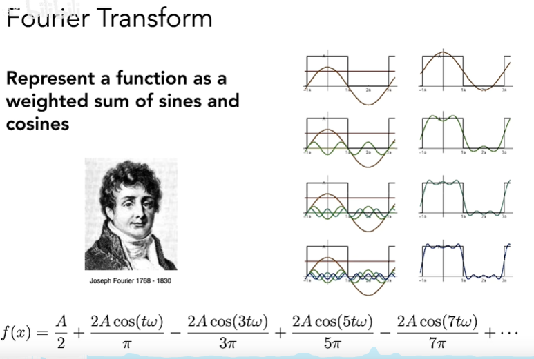  
`f(x)`函数可以由若干个`sin`和`cos`函数来逼近，这里因为`f(x)`比较特殊，是偶函数，`sin`项全是零了。这里`t,3t,5t...`是用来控制`cos`的频率，而$\frac{2A}{\pi}$这种系数是控制相位，这样由无穷个`cos`组成的函数可以无限逼近原函数`f(x)`。一个函数可以表示成其他函数的线性组合，那么我们称些函数为`基函数`。这里基函数前面乘上一个系数然后加起来就可以得到原函数了:  
$$
\begin{align}
f(x)=\sum_{i}c_i\cdot B_i(x) \tag{1}
\end{align}
$$
这些系数可以由投影操作得到，也就是两种函数`f(w)`,`B(w)`的乘积再积分：  
$$
\begin{align}
c_i=\int_{\Omega}f(w)B_i(w)\text{d}w \tag{2}
\end{align}
$$
这里`f(w)`就是我们要的`原函数`，`B(w)`则是一系列`球面谐波基函数`。只要有两种函数存在这样的一种计算方式，我们也认为这存在一定的滤波意义。而滤波后得到的值，该值的频率由`f(w)`和`B(w)`中最低频的函数决定。  

球面谐波基函数的可视化如下：  
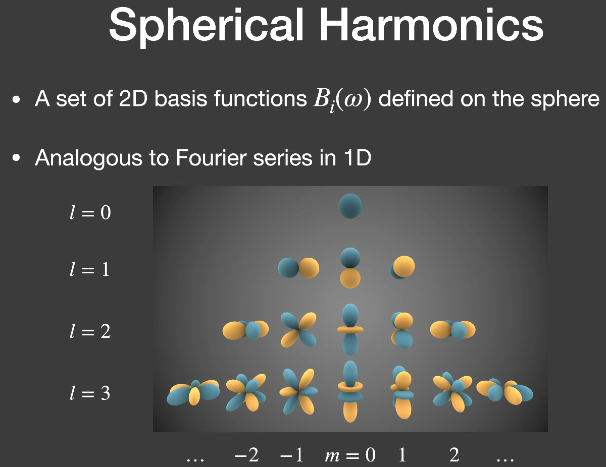  
其中前`n`层的基函数个数为`n^2`，颜色表基函数的值，越蓝的地方值越大，越黄的地方其绝对值越大。而频率就是这些值的变化，可以看到下面的函数频率比上面的函数要大。`l`层数越大用到的基函数越多，就能表示原函数更高频的内容，但是如果原函数本来就很低频，或者因为该函数`f(x)`与一个很低频的函数`g(x)`进行乘积再积分，那我们只需要用前几层的基函数就可以恢复出原函数。  
所以我们用球面谐波基函数来恢复`Diffuse`物体的光照就非常合适，`Diffuse`物体的`BRDF`是一个常数$\frac{c}{\pi}$，而所需要的光照也不需要很高频。实验表明，用前三层的基函数恢复出的光照信息就可以使`Diffuse`物体的`Shading`结果非常正确，平均误差小于`3%`:  
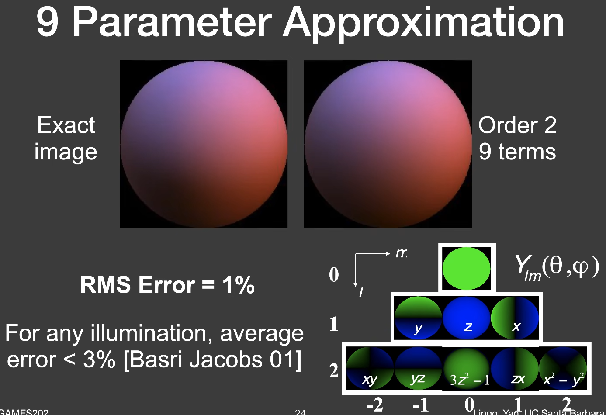  
需要注意的是球面谐波基函数是用来恢复光照和光传输。  

接下来我们来看一下渲染方程：  
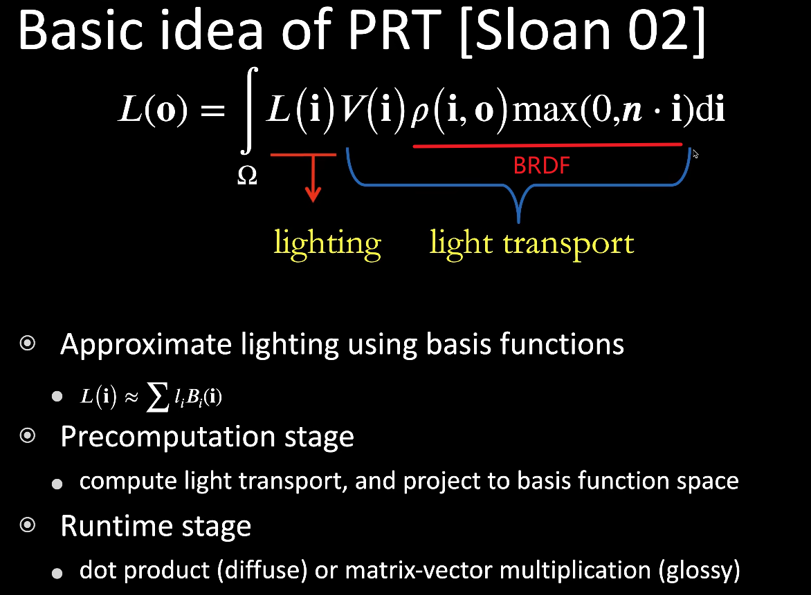  
`Lighting`部分和`Light transport`部分都可以通过球面谐波基函数来近似。对于`Lighting`部分，由于基函数是固定的，只要我们求出了场景光照对应的基函数系数，在场景切换时，`shading`结果也可以发生改变。但是`Light transport`部分，由于预计算时，每一个`Shading point`看向场景的`visibility`项需要固定住，所以场景中的物体不能发生改动，这是一个缺点。  

对于这样一个渲染方程，我们假设光源可能发生变化，场景中的物体都不会发生变化，我们可以将`Lighting`和`Light transport`投影到球面谐波基函数上，然后进行预计算，得到他们的基函数系数，最后用这些系数来计算`shading`的结果，这就是`PRT`做的事情。  
现在的问题是我们怎么通过这些基函数系数来得到我们想要的`Shading`结果，我们来深入了解一下渲染方程经过投影的形式，这里以`Diffuse`物体的渲染方程为例：   
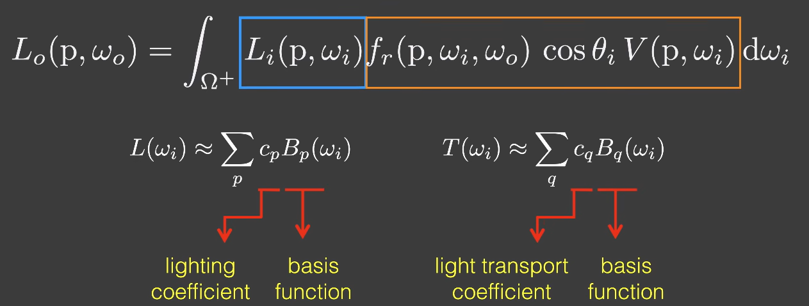  
这里$f_r(p,w_i,w_o)$为常数$\frac{c}{\pi}$，整个右边橙色框内的函数，是一个二维的球面函数，因为`Diffuse`物体在任何方向看到结果都是一样的，即跟`W_o`无关。将`Lighting`和`Light transport`用基函数系数和基函数的表达式带入方程中得：  
$$
\begin{align}
& L_o(p,w_o)=\int_{\Omega+}L_i(p,w_i)f_r(p,w_i,w_o)cos\theta_iV(p,w_i)\text{d}w_i \\
& =\int_{\Omega+}\sum_pl_pB_p(w_i)\sum_qt_qB_q(w_i) \\
& =\sum_p\sum_ql_pt_q\int_{\Omega+}B_p(w_i)B_q(w_i)\text{d}w_i \tag{3}
\end{align}
$$
这里求和的积分和积分的求和在图形学中大多数情况都是可以交换的。  
由于球面谐波基函数是一组标准正交基函数，所以其具备一下性质：  
$$
\begin{align}
& \int_{\Omega+}B_i(w)B_j(w)\text{d}w=0,i\neq j \\
& \int_{\Omega+}B_i(w)B_j(w)\text{d}w=1,i=j \tag{4}
\end{align}
$$
所以上面`3`式可以写成以下形式：  
$$
\begin{align}
& =\sum_p\sum_ql_pt_q\int_{\Omega+}B_p(w_i)B_q(w_i)\text{d}w_i \\
& =\sum_il_it_i \tag{5}
\end{align}
$$
如果`Lighting`和`Light transport`投影到球面谐波基函数的前`3`层，则最后得到的基函数系数`l_i`和`t_i`,都是`9`维向量，在最后`shading`时，像素显示出来的颜色就是它们的点乘结果。

## Calculate the real basis spherical harmonics   

上面小节我们已经大致理解了球面谐波基函数是如何用来预计算光照和光传输，但是对于这个基函数是怎么来的，我想很多人跟我一样有些疑惑。这一小节我们就来看下具体的一个基函数是怎么样算得的，以后如果需要用到高层基函数，能自己通过程序算出来。下面内容大部分来自维基百科，我只是做好了整理工作方便大家理解。  

`SH函数`通常是在复数域上定义的，而实数域的`SH基函数`又可以由复数域上定义的`SH函数`算得，`SH基函数`则是由`伴随勒让德多项式`以及`归一化系数`组成：  
The real spherical harmonics  
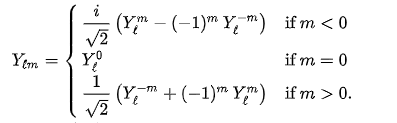  
The complex spherical harmonics  
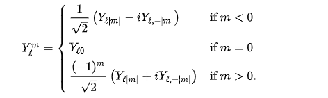  
The real basis spherical harmonics  
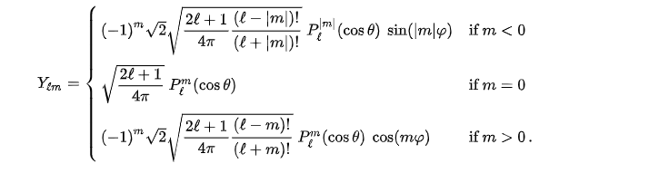  
其中$P_{l}^{m}(cos\theta)$为`伴随勒让德多项式`，它是`勒让德偏微分方程`的一组解，其闭式为：  
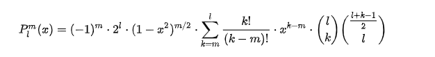  
其中后面两个括号括起来的东西叫做[二项式系数]([Binomial coefficient](https://en.wikipedia.org/wiki/Binomial_coefficient#Generalization_and_connection_to_the_binomial_series))，其阶乘式如下：  
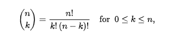   
上面式子的来源或定义啥的，我们就不在细究了，我们的目的是要搞懂`实域SH基函数`怎么算！

这个伴随勒让德多项式的闭式有点复杂，可以用来计算，但是如果用计算机来算的话这个式子不是很友好，但是在`l`和`m`相等时，它可以写成另一种表达式，下面式子[来源于此](https://mathworld.wolfram.com/AssociatedLegendrePolynomial.html)：  
$$
\begin{align}
P_{m}^{m}=(-1)^m(2m-1)!!(1-x^2)^{\frac{m}{2}} \tag{6}
\end{align}
$$
$$
\begin{align}
P_{m+1}^{m}=x(2m+1)P_{m}^{m} \tag{7}
\end{align}
$$
有了这两个递推公式，高层$P_{l}^{m}(x)$，就可以通过程序来递推生成，当然我这里没有用代码来实现这个算法，等到什么时候要用的时候再来实现也不迟😏。  

好了虽然没有用代码来实现这部分内容，但是我可以手算一个例子，来理一下逻辑，就以`Real spherical harmonics`的$Y_{1,-1}$为例，例子可以在[这里](https://en.wikipedia.org/wiki/Table_of_spherical_harmonics)找到：  
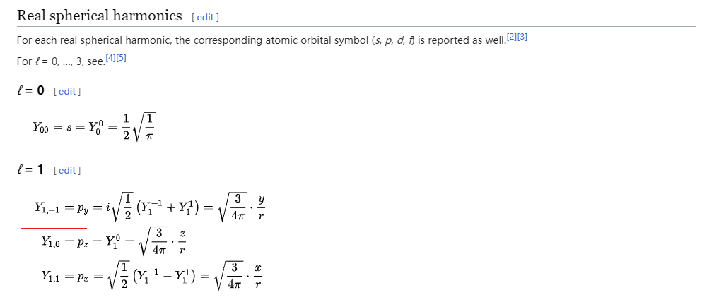
将l=1,m=-1带入到上面`The real spherical harmonics`得：   
$$
\begin{align}
Y_{1,-1}=\frac{i}{\sqrt{2}}(Y_{1}^{-1}+Y_{1}^{1}) \tag{7}
\end{align}
$$
其中$Y_{1}^{-1}$和$Y_{1}^{1}$是复数域的`SH函数`，根据欧拉公式和`SH`基函数公式以及伴随勒让德公式，分别计算它们：   
$$
\begin{align}
\text{e}^{\pm i\phi}=\cos\phi\pm i\sin\phi \tag{8}
\end{align}
$$
$$
\begin{align}
& Y_{1}^{-1}=\frac{1}{\sqrt{2}}(-\sqrt{\frac{3}{4\pi}})\cdot(-(1-\cos^2\theta)^{\frac{1}{2}})\cdot(\cos(\phi)-i\sin(\phi)) \\
& Y_{1}^{-1}=\frac{1}{2}\sqrt{\frac{3}{2\pi}}\sin\theta\cdot\text{e}^{-i\phi} \tag{9}
\end{align}
$$
$$
\begin{align}
& Y_{1}^{1}=-\frac{1}{\sqrt{2}}(-\sqrt{\frac{3}{4\pi}})\cdot(-(1-\cos^2\theta)^{\frac{1}{2}})\cdot(\cos(\phi)+i\sin(\phi)) \\
& Y_{1}^{1}=-\frac{1}{2}\sqrt{\frac{3}{2\pi}}\sin\theta\cdot\text{e}^{i\phi} \tag{10}
\end{align}
$$
再根据球坐标转笛卡尔坐标公式，得到复数域笛卡尔坐标系下的`SH函数`：  
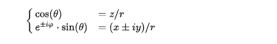  
$$
\begin{align}
& Y_{1}^{-1}=\frac{1}{2}\sqrt{\frac{3}{2\pi}}\sin\theta\cdot\text{e}^{-i\phi} \\
& Y_{1}^{-1}=\frac{1}{2}\sqrt{\frac{3}{2\pi}}\frac{x-iy}{r} \tag{11}
\end{align}
$$
$$
\begin{align}
& Y_{1}^{1}=-\frac{1}{2}\sqrt{\frac{3}{2\pi}}\sin\theta\cdot\text{e}^{i\phi} \\
& Y_{1}^{1}=-\frac{1}{2}\sqrt{\frac{3}{2\pi}}\frac{x+iy}{r} \tag{12}
\end{align}
$$
将上面`11`式和`12`式带入到`7`式中：  
$$
\begin{align}
& Y_{1,-1}=\frac{i}{\sqrt{2}}(Y_{1}^{-1}+Y_{1}^{1}) \\
& Y_{1,-1}=\frac{i}{\sqrt{2}}(\frac{1}{2}\sqrt{\frac{3}{2\pi}}\frac{x-iy}{r}-\frac{1}{2}\sqrt{\frac{3}{2\pi}}\frac{x+iy}{r}) \\
& Y_{1,-1}=\frac{1}{\sqrt{2}}\sqrt{\frac{3}{2\pi}}\frac{-i^2y}{r} \\
& Y_{1,-1}=\sqrt{\frac{3}{4\pi}}\frac{y}{r} \tag{13}
\end{align}
$$

这样就得到了图形学中经常用`SH函数`。我们可以将这个式子硬编码在代码中：  
```cpp
double HardcodedSH1n1(const Eigen::Vector3d& d) {
  // -sqrt(3/(4pi)) * y
  return -0.488603 * d.y();
}
```
这里`r`=1，但是我目前还不知道为什么要加负号😑，可能是`cubemap`方向向量的坐标系和`SH函数`的坐标系不同导致的。 

## 预计算环境光照   

这部分还是根据上面`2`式投影公式来算环境光照的`SH`系数，这里将它转换为黎曼和求其积分:  
$$
\begin{align}
& SH_{coeff}=\int_{S}L_{env}(w_i)SH(w_i)\text{d}w_i \\
& \widehat{SH_{coeff}}=\sum_iL_{env}(w_i)SH(w_i)\Delta w_i \tag{14}
\end{align}
$$
这里用黎曼和的方式求积分的好处是，[有个办法](https://www.rorydriscoll.com/2012/01/15/cubemap-texel-solid-angle/)可以精确求出像素投影到单位球上的面积，如图：  
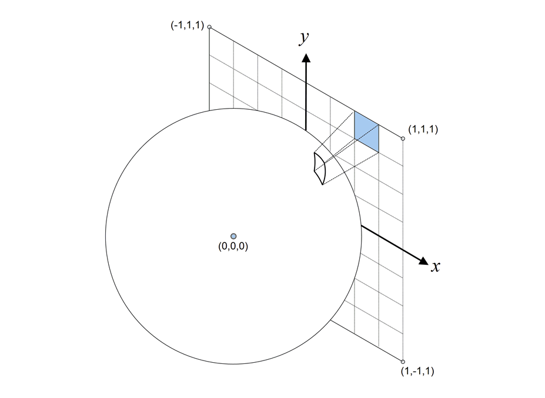  
我这里简单概述一下它这个方法是怎么处理的。
首先我们可以通过框架给的方法求出每个像素对应的向量（未归一化）：
```cpp
//索引像素对应的方向
Eigen::Vector3f dir = cubemapDirs[i * width * height + y * width + x];
```
然后我们就可以得到该向量归一化后的表达式：  
$$
\begin{align}
\vec{p}=\frac{(x,y,1)}{\sqrt{x^2+y^2+1}} \tag{15}
\end{align}
$$
这个向量的`z`分量如下：  
$$
\begin{align} 
& p_z=\frac{1}{\sqrt{x^2+y^2+1}} \\
& =(x^2+y^2+1)^{-\frac{1}{2}} \\
& =u^{-\frac{1}{2}}
\tag{16}
\end{align}
$$
然后通过链式法则，对它进行求偏导，得到该`z`分量沿`x`轴的变化率：  
$$
\begin{align}
& \frac{\partial{p_z}}{\partial{x}}=\frac{\partial{p_z}}{\partial{u}}\frac{\partial{u}}{\partial{x}} \\
& =-\frac{x}{(x^2+y^2+1)^{\frac{3}{2}}}
\tag{17}
\end{align}
$$
有了`z`分量的偏导，`x`分量可以表示为：  
$$
\begin{align} 
& p_x=\frac{x}{\sqrt{x^2+y^2+1}} \\
& =xp_z
\end{align} \tag{18}
$$
对其求偏导可以用乘积法则写成以下形式：  
$$
\begin{align}
& \frac{\partial{p_x}}{\partial{x}}=p_z\frac{\partial{x}}{\partial{x}}+x\frac{\partial{p_z}}{\partial{x}} \\
& =\frac{y^2+1}{(x^2+y^2+1)^{\frac{3}{2}}}
\end{align} \tag{19}
$$
`y`分量也可以用相同方式求偏导：  
$$
\begin{align}
& p_y=\frac{y}{\sqrt{x^2+y^2+1}}=yp_z \\
& \frac{\partial{p_y}}{\partial{x}}=p_z\frac{\partial{y}}{\partial{x}}+y\frac{\partial{p_z}}{\partial{x}} \\
& =-\frac{xy}{(x^2+y^2+1)^{\frac{3}{2}}}
\end{align} \tag{19}
$$
以相同方式可以求得该向量沿`y`轴的变化率：  
$$
\begin{align}
& \frac{\partial{\vec{p}}}{\partial{x}}=\frac{(y^2+1,-xy,-x)}{(x^2+y^2+1)^{\frac{3}{2}}} \\
& \frac{\partial{\vec{p}}}{\partial{y}}=\frac{(-xy,x^2+1,-y)}{(x^2+y^2+1)^{\frac{3}{2}}}
\end{align} \tag{20}
$$
然后算`x`轴的变化率叉乘`y`轴变化率，得到叉乘后的向量，再求它的模就是原点和变化点间的微分面积：  
$$
\begin{align}
& \vec{r}=\frac{\partial{\vec{p}}}{\partial{x}}\times\frac{\partial{\vec{p}}}{\partial{y}} \\
& =\frac{(x,y,1)}{(x^2+y^2+1)^2}
\end{align} \tag{21}
$$
$$
\begin{align}
& \partial{A}=\sqrt{\vec{r}\cdot\vec{r}} \\
& =\frac{1}{(x^2+y^2+1)^{\frac{3}{2}}}
\end{align} \tag{22}
$$
最后一步是在像素空间内对微分面积进行积分，以获得像素投影到单位球上的立体角。我们可以计算原点`(0,0)`到`cubemap`上的某个点`(s,t)`的积分值：  
$$
\begin{align}
& f(s,t)=\int_{y=0}^{t}\int_{x=0}^{s}\frac{1}{(x^2+y^2+1)^{\frac{3}{2}}}\text{d}x\text{d}y \\
& =\tan^{-1}\frac{st}{\sqrt{s^2+t^2+1}}
\end{align} \tag{23}
$$
有了这个公式，我们可以通过将两个右对角`A`和`C`的面积加在一起，减去左对角`B`和`D`的面积来计算任何像素投影到单位球的立体角：  
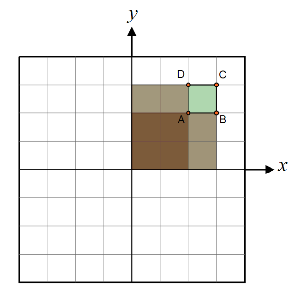  
对应的代码实现如下：  
```cpp
float CalcPreArea(const float &x, const float &y){
    //atan2的优势是可以正确处理异常的情况
    return std::atan2(x * y, std::sqrt(x * x + y * y + 1.0));
}
float CalcArea(const float &u_, const float &v_, const int &width,
                const int &height){
    // transform from [0,1] to [-1,1]
    // ( 0.5 is for texel center addressing)
    float u = (2.0 * (u_ + 0.5) / width) - 1.0;
    float v = (2.0 * (v_ + 0.5) / height) - 1.0;

    float invResolutionW = 1.0 / width;
    float invResolutionH = 1.0 / height;

    // u and v are the [-1,1] texture coordinate on the current face.
    // get projected area for this texel
    float x0 = u - invResolutionW;
    float y0 = v - invResolutionH;
    float x1 = u + invResolutionW;
    float y1 = v + invResolutionH;
    float angle = CalcPreArea(x0, y0) - CalcPreArea(x0, y1) -
                    CalcPreArea(x1, y0) + CalcPreArea(x1, y1);

    return angle;
}
```
回到上面`14`式：  
$$
\begin{align}
& \widehat{SH_{coeff}}=\sum_iL_{env}(w_i)SH(w_i)\Delta w_i 
\end{align}
$$
有了立体角的面积，框架也提供了环境光的`RGB`值以及硬编码的`SH`函数，实现就是下面的代码：  
```cpp
for (int y = 0; y < height; y++){
    for (int x = 0; x < width; x++){
        // TODO: here you need to compute light sh of each pixel of each face of cubemap 

        //索引像素对应的方向
        Eigen::Vector3f dir = cubemapDirs[i * width * height + y * width + x];
        //像素的索引
        int index = (y * width + x) * channel;
        //RGB值
        Eigen::Array3f Le(images[i][index + 0], images[i][index + 1],
                            images[i][index + 2]);

        // Edit Start
        auto delta_w = CalcArea(x, y, width, height);

        for (int l = 0; l <= SHOrder; l++) {
            for (int m = -l; m <= l; m++) {
                //获取基函数
                auto basic_sh_proj = sh::EvalSH(l, m, Eigen::Vector3d(dir.x(), dir.y(), dir.z()).normalized());
                //计算le在基函数上的投影，并且用黎曼和近似积分
                SHCoeffiecents[sh::GetIndex(l, m)] += Le * basic_sh_proj * delta_w;
            }
        }
        // Edit End
    }
}
```
最后生成的`SHCoeffiecents`如下：  
```cpp
    R               G               B
1.91613         1.71772         1.07797
-0.0591127      -0.0574315      -0.0346851
-3.8612e-05     -2.09015e-05    -1.35017e-05
0.439589        -0.431271       -0.0800766
-0.0306302      0.0319348       0.00328068
0.0758103       0.0710374       0.0591078
0.311676        0.269456        0.309399
-4.15644e-05    6.26793e-05     3.12488e-05
-0.541544       -0.468526       -0.536088
```

## 预计算光传输   

在上一节我们已经将环境光照投影到SH函数上，得到了对应的`SHCoeffiecents`，剩下的部分对于有自阴影的`Shadowed`漫反射传输，预计算方程多了一项可见性(Visibility term)：  
$$
\begin{align}
L_{DS}=\frac{c}{\pi}\int_{S}V(w_i)max(N_x\cdot w_i,0)\text{d}w_i
\end{align} \tag{24}
$$
对于这个式子，我们还是用蒙特卡洛来求积分，这里`S`表示整个球，其实我觉得用半球的`Cos weight`更好，但是当时是直接实现的整球采样，后面就一直没改了。所以现在还是以整球为例来讲解采样过程，`Cos weight`类似其过程：  
单位球上的一个采样点落在`dw_i`的概率密度函数设为$P(w_i)$：  
对于这个`PDF`，在整球范围内积分为`1`，则我们可以得到如下等式：  
$$
\begin{align}
\int_{\phi}\int_{\theta}P(w_i)\text{d}w_i=1
\end{align} \tag{25}
$$
由于`dw`在整球范围内积分的结果是`4πR^2`，单位整球则是`4π`，`PDF`的值为`1/4π`，则上述式子可以写成：  
$$
\begin{align}
\int_{\phi}\int_{\theta}\frac{1}{4\pi}\sin\theta\text{d}\theta\text{d}\phi=1
\end{align} \tag{26}
$$
分别计算它们的边缘概率密度函数：  
$$
\begin{align}
& P(\theta)=\int_{0}^{2\pi}\frac{1}{4\pi}\sin\theta\text{d}\phi=\frac{\sin\theta}{2} \\
& P(\phi)=\int_{0}^{\pi}\frac{1}{4\pi}\sin\theta\text{d}\theta \\
& =-\frac{1}{4\pi}\cos\theta|_{0}^{\pi} \\
& =\frac{1}{2\pi}
\end{align} \tag{26}
$$
分别计算它们的累积分布函数：  
$$
\begin{align}
& F(\theta)=\int_{0}^{\theta}\frac{\sin\theta}{2}\text{d}\theta \\
& =-\frac{\cos\theta}{2}|_{0}^{\theta} \\
& =\frac{1-\cos\theta}{2} \\
& F(\phi)=\int_{0}^{\phi}\frac{1}{2\pi}\text{d}\phi=\frac{\phi}{2\pi}
\end{align} \tag{27}
$$
均匀的从`U[0,1]`中取出两个随机数$X_{1}$和$X_{2}$,则我们要的采样`θ`和`φ`为： 
$$
\begin{align}
& F^{-1}(\theta)=\theta=\arccos(1-2X_1) \\
& F^{-1}(\phi)=\phi=2\pi X_2
\end{align} \tag{27}
$$
这种方式得到的采样点如下：  
   
有了采样方向，就可以算积分值了，代码实现如下：  
```cpp
for (int t = 0; t < sample_side; t++) {
    for (int p = 0; p < sample_side; p++) {
        //分层采样，使采样点更加均匀。
        double x1 = (t + nori::genRandomFloat()) / sample_side;
        double x2 = (p + nori::genRandomFloat()) / sample_side;

        double phi = 2.0 * M_PI * x1;
        double theta = acos(2.0 * x2 - 1.0);

        double func_value = func(phi, theta);

        // evaluate the SH basis functions up to band O, scale them by the
        // function's value and accumulate them over all generated samples
        for (int l = 0; l <= order; l++) {
        for (int m = -l; m <= l; m++) {
            double sh = EvalSH(l, m, phi, theta);
            //蒙特卡洛积分
            double pdf = 1.0 / (4 * M_PI);
            (*coeffs)[GetIndex(l, m)] += 1 / M_PI * func_value * sh / pdf / sample_count;
        }
        }
    }
}
```
`func_value`就是渲染方程中`Cos`值，如果顶点向外发射光线时没有被挡住则`func_value == dot(N,w)`，挡住了就是`0`。至于这里`θ`为什么和上面的公式不一样，我当时是直接用的[这篇文章](https://www.bogotobogo.com/Algorithms/uniform_distribution_sphere.php)算出来的结果，现在过来写博客时发现他算错了，不过不影响最后的结果，就是θ值互补。  

## 预计算间接光传输  

有了直接光的光传输，间接光的光传输就好办了，但是直接看作业文档给的公式容易被误导，不过好在它下面给出了解释，我这里就不列公式了，看下它的解释：  
1. 对于每个顶点，计算它的$L_{DS}$，在上一节内容中，我们已经做了这个事情，可以拿来复用。
2. 从当前顶点发射光线，如果当前光线与其他三角形相交，则在交点处求出重心坐标插值后的球面谐波系数，这个系数就表示间接光照的球面谐波系数，所以这里其实不用算积分值。
3. 对于这个反射回来的间接光，乘以几何项`dot(N,w_i)`。
4. 以当前射线为交点，从第`2`步计算以当前交点为初试顶点的$L_{DS}$，重复这个步骤直到`Bounce`次数到达预设值，然后结束递归。
实现如下：  
```cpp
template<typename T>
std::unique_ptr<std::vector<double>> computeInterreflectionSH(Eigen::MatrixXf* directTSHCoeffs, 
                                                            const Point3f& pos, const Normal3f& normal, T&& Lds,
                                                            const Scene* scene, int bounces)
{
    std::unique_ptr<std::vector<double>> coeffs(new std::vector<double>());
    coeffs->assign(SHCoeffLength, 0.0);

    for (int i = 0; i < coeffs->size(); i++){
        (*coeffs)[i] += Lds[i];
    }

    if (bounces >= m_Bounce)
        return coeffs;

    const int sample_side = static_cast<int>(floor(sqrt(m_SampleCount)));
    for (int t = 0; t < sample_side; t++) {
        for (int p = 0; p < sample_side; p++) {
            double x1 = (t + nori::genRandomFloat()) / sample_side;
            double x2 = (p + nori::genRandomFloat()) / sample_side;
            double phi = 2.0 * M_PI * x1;
            double theta = acos(2.0 * x2 - 1.0);

            Eigen::Array3d d = sh::ToVector(phi, theta);
            const auto wi = Vector3f(d.x(), d.y(), d.z());
            double pdf = 1.0 / (4 * M_PI);
            double H = wi.normalized().dot(normal);
            Intersection its;
            if (H > 0.0 && scene->rayIntersect(Ray3f(pos, wi.normalized()), its)){
                MatrixXf normals = its.mesh->getVertexNormals();
                Point3f idx = its.tri_index;
                Point3f hitPos = its.p;
                Vector3f bary = its.bary;
                //利用重心坐标插值三角形各顶点的法向量
                Normal3f hitNormal =
                    Normal3f(normals.col(idx.x()).normalized() * bary.x() +
                        normals.col(idx.y()).normalized() * bary.y() +
                        normals.col(idx.z()).normalized() * bary.z())
                    .normalized();
                //重心坐标插值三角形各顶点的(V * brdf * wiDotN)投影到球谐基函数后得到的coeffs值
                auto interpolateSH = 
                        directTSHCoeffs->col(idx.x()) * bary.x() +
                        directTSHCoeffs->col(idx.y()) * bary.y() +
                        directTSHCoeffs->col(idx.z()) * bary.z();
                auto nextBouncesCoeffs = computeInterreflectionSH(directTSHCoeffs, hitPos, hitNormal, interpolateSH ,scene, bounces + 1);

                for (int i = 0; i < SHCoeffLength; i++){
                    //采样到投影后的coeffes乘以cos做权重，这里不是蒙特卡洛积分。
                    (*coeffs)[i] +=  (*nextBouncesCoeffs)[i] * H / m_SampleCount;
                    // (*coeffs)[i] += 1 / M_PI * (*nextBouncesCoeffs)[i] * H / pdf / m_SampleCount;//Incorrect method
                }
            }
        }
    }
    return coeffs;
}
// TODO: leave for bonus
m_InterTransportSHCoeffs.resize(SHCoeffLength, mesh->getVertexCount());
#pragma omp parallel for
for (int i = 0; i < mesh->getVertexCount(); i++){
    const Point3f& v = mesh->getVertexPositions().col(i);
    const Normal3f& n = mesh->getVertexNormals().col(i).normalized();
    auto indirectCoeffs = computeInterreflectionSH(&m_TransportSHCoeffs, v, n,m_TransportSHCoeffs.col(i), scene, 0);
    for (int j = 0; j < SHCoeffLength; j++){
        m_InterTransportSHCoeffs.col(i).coeffRef(j) = (*indirectCoeffs)[j];
    }
}
m_TransportSHCoeffs = m_InterTransportSHCoeffs;
```
效果如下：  
  
读者有时间可以优化一下这个算法，吧对整球的采样改成`cos weight`半球采样，速度更快效果更好。  

## 使用预计算的数据进行Shading

我们回顾一下上面5式的结果：  
$$
\begin{align}
& L_o(p,w_o)=\sum_il_it_i 
\end{align}
$$
在`webgl`中要做的事情就是将预计算的`SHCoeffiecents`向量，传入到顶点着色器里，然后逐点相乘再求和，就是我们要的颜色值。最后做一下`Gamma Correction`和`Tone Mapping`将线性空间的颜色转换到sRGB空间。  
```cpp
attribute vec3 aVertexPosition;
attribute vec3 aNormalPosition;
//光传输投影到前三层SH函数得到的系数，一个顶点包含9个系数，用mat3来存储。
attribute mat3 aPrecomputeLT;
//光照投影到前三层SH函数得到的系数，一个顶点包含27个系数，R对应9个，G对应9个，B对应9个，用三个mat3来存储
uniform mat3 uPrecomputeL[3];
varying highp vec3 vColor;
float L_dot_LT(mat3 PrecomputeL, mat3 PrecomputeLT) {
  vec3 L_0 = PrecomputeL[0];
  vec3 L_1 = PrecomputeL[1];
  vec3 L_2 = PrecomputeL[2];
  vec3 LT_0 = PrecomputeLT[0];
  vec3 LT_1 = PrecomputeLT[1];
  vec3 LT_2 = PrecomputeLT[2];
  return dot(L_0, LT_0) + dot(L_1, LT_1) + dot(L_2, LT_2);
}
void main(void) {
  for(int i = 0; i < 3; i++){
    //RGB对应的SH系数分别做点乘，得到最后RGB值。
    vColor[i] = L_dot_LT(uPrecomputeL[i],aPrecomputeLT);
  }
  ...
}
```
这个`Gamma Correction`和`Tone Mapping`在`Nori`框架中有个API已经实现，我们用它那个就行：
```cpp
Color3f Color3f::toSRGB() const {
    Color3f result;
    for (int i=0; i<3; ++i) {
        float value = coeff(i);
        if (value <= 0.0031308f)
            result[i] = 12.92f * value;
        else
            result[i] = (1.0f + 0.055f)
                * std::pow(value, 1.0f/2.4f) -  0.055f;
    }
    return result;
}
```