# 效果图  

由于测试时我电脑的GPU是办公本的核显（GPU AMD Radeon(TM) 530），帧率很低，我就在比较简单的环境（cube1）下比较它们的纯镜面反射差异。  

World Space SSR  
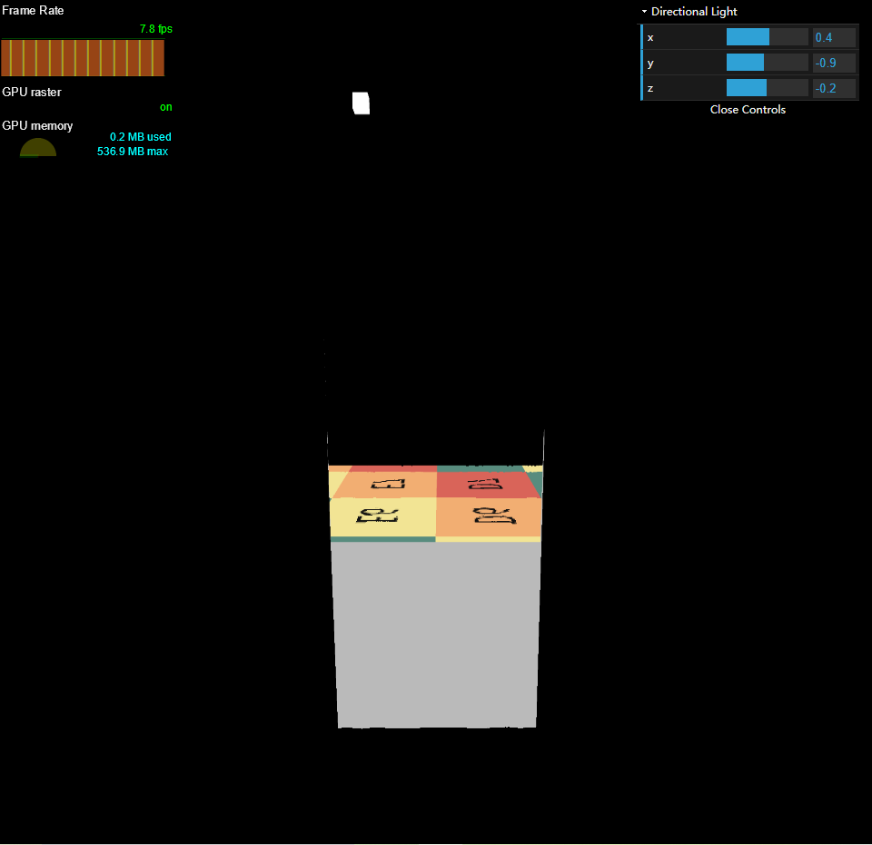  
Efficient GPU SSR  
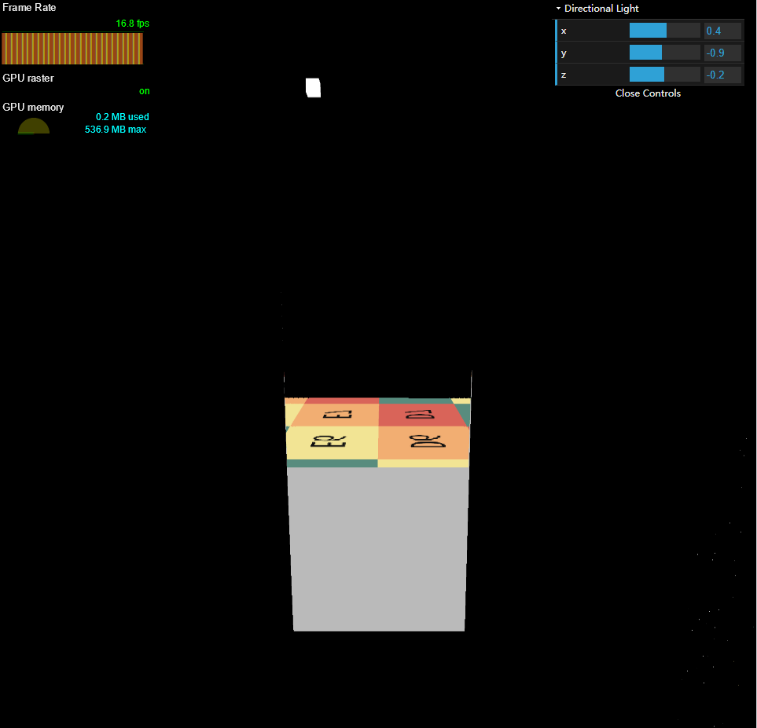  
Hierarchical-Z SSR  
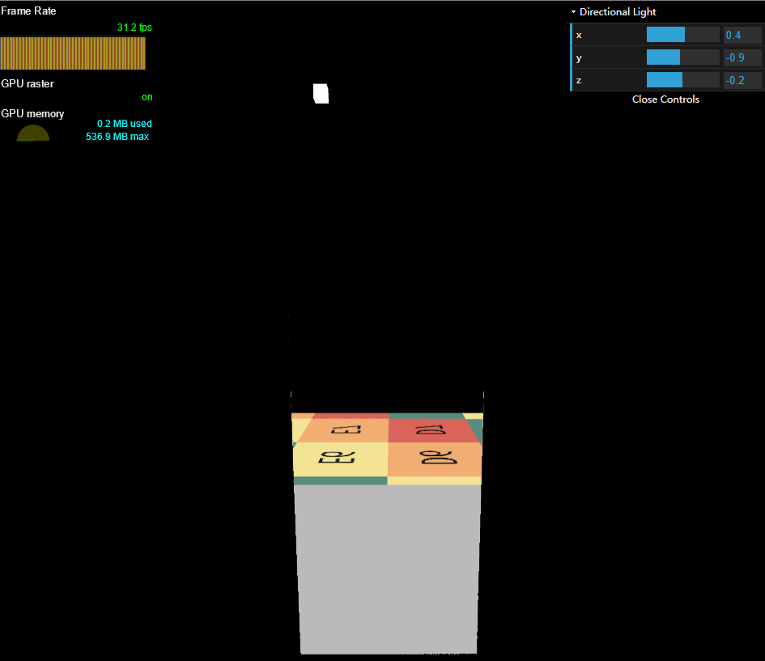  
可以看到`Hierarchical-Z SSR`的帧率最高，是`World Space SSR`帧率的4倍，其次是`Efficient GPU SSR`是`World Space SSR`帧率的2倍。  

# 作业总览  

1. 实现直接光照。  
2. 实现Screen Space Ray Tracing。  
3. 实现间接光照。  
4. Bonus 1：实现Mipmap优化的 Screen Space Ray Tracing。  

个人扩展：`Efficient GPU Screen-Space Ray Tracing`   

# 源码  

暂未公开。

# 前言  

本文重点放在算法本身，源码中相关地方注释很明确，对于框架的理解不再做过多解释。  
本次SSR算法总共有三种，分别World Space Ray Marching SSR,[Efficient GPU SSR](https://jcgt.org/published/0003/04/04/paper.pdf)和[Hierarchical-Z SSR](https://sugulee.wordpress.com/2021/01/19/screen-space-reflections-implementation-and-optimization-part-2-hi-z-tracing-method/)。  

# 实现  

## World Space Ray Marching SSR  

本次作业的基础部分比较简单，算法本身并不复杂，所以这里就附带将`SSR Pass`的准备工作一并讲一下，这也为后面的算法做好准备。  

### 直接光照  

我们先看下渲染方程，这里以`SSAO`为例讲解一下`Visibility`怎么处理：  
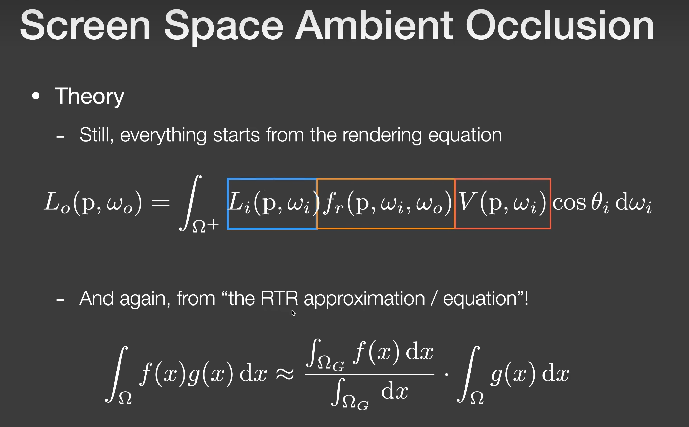  
通过上图所说的`The RTR Approximation`，我们可以得到`Visibility`拆出后的方程：  
$$
\begin{align}
& L_o(p,w_o)=\int_{\Omega+}L_i(p,w_i)f_r(p,w_i,w_o)V(p,w_i)\cos\theta_i dw_i \\
& \approx \frac{\rho}{\pi}\cdot L_i(p)\cdot\pi\cdot\frac{\int_{\Omega+}V(p,w_i)\cos\theta_i dw_i}{\pi} \tag{1}
\end{align}
$$
但`SSAO`考虑的是`diffuse`物体局部范围内不带颜色的全局光照，其积分域在各个方向上都可能有贡献，所以这里要算积分值。  
而我们要实现的直接光照是来自平行光，平行光和点光源的一个重要特性：  
光源的方向是确定的，也就是说平行光和点光源到着色点只会有一条光线有贡献，其他方向上的贡献为`0`。那我们也就不用积分了，上述渲染方程直接为：  
$$
\begin{align}
L_o(p,w_o)=L_i(p,w_i)f_r(p,w_i,w_o)V(p,w_i)\cos\theta_i \tag{2}
\end{align}
$$
所以代码实现就简单了，如下：  
```cpp
//直接光照
//L = V * Le * brdf * cos
vec3 L_Normal = GetGBufferNormalWorld(screenUV);
L = EvalDiffuse(screenUV) * EvalDirectionalLight(screenUV) * max(0., dot(L_Normal, wi));
```
`V`项包含在`EvalDirectionalLight`函数中。  

可以看到`Normal`等信息是从`Gbuffer`中获得的，`Gbuffer`纹理可以理解成是帧缓冲的`Color Attachment`，我们现在创建一个帧缓冲，并为它提供`4`个`Color Attachment`:  
```js
class FBO{
    constructor(gl, GBufferNum, width, height){
        ...
        function CreateAndBindColorTargetTexture(fbo, attachment, width, height) {
            //创建纹理对象并设置其尺寸和参数
            var texture = gl.createTexture();
            ...
            gl.bindTexture(gl.TEXTURE_2D, texture);
            gl.texImage2D(gl.TEXTURE_2D, 0, gl.RGBA32F, width, height, 0, gl.RGBA, gl.FLOAT, null);
            ...
            gl.framebufferTexture2D(gl.FRAMEBUFFER, attachment, gl.TEXTURE_2D, texture, 0);
            return texture;
        };
        ...
        //创建帧缓冲区对象并绑定
        var framebuffer = gl.createFramebuffer();
        gl.bindFramebuffer(gl.FRAMEBUFFER, framebuffer);
        //在JavaScript中，对象是动态的，可以随时添加属性和方法
	    framebuffer.attachments = [];
	    framebuffer.textures = []
        ...
	    for (var i = 0; i < GBufferNum; i++) {
            var attachment = gl.COLOR_ATTACHMENT0 + i;
	    	// var texture = CreateAndBindColorTargetTexture(framebuffer, attachment);
            var texture = CreateAndBindColorTargetTexture(framebuffer, attachment, width, height, 0);
	    	framebuffer.attachments.push(attachment);
	    	framebuffer.textures.push(texture);

            if(gl.checkFramebufferStatus(gl.FRAMEBUFFER) != gl.FRAMEBUFFER_COMPLETE)
                console.log(gl.checkFramebufferStatus(gl.FRAMEBUFFER));
	    }
	    // * Tell the WEBGL_draw_buffers extension which FBO attachments are
	    //   being used. (This extension allows for Multiple Render Targets.)
        gl.drawBuffers(framebuffer.attachments);
        ...
        return framebuffer;
    }
}
camera.fbo = new FBO(gl, 4);
const directionLight = new DirectionalLight(lightRadiance, lightPos, lightDir, lightUp, renderer.gl);
```
其中`ShadowBuffer`在创建方向光对象时被创建，而`Gbuffer`附加在相机对象上，`Gbuffer`包含的`4`张纹理如下：  
```js
void main(void) {
  vec3 kd = texture(uKd, vTextureCoord).rgb;
  //albedo 
  Frag0 = vec4(kd, 1.0);
  //depth not linear
  Frag1 = vec4(vec3(gl_FragCoord.z), 1.0);
  //world space normal(uNt)
  Frag2 = vec4(ApplyTangentNormalMap(), 1.0);
  //shadow value 0 or 1
  Frag3 = vec4(vec3(SimpleShadowMap(vPosWorld.xyz, 1e-4)), 1.0);
}
```
`Gbuffer`准备好以后，我们就可以得到直接光的效果了：  
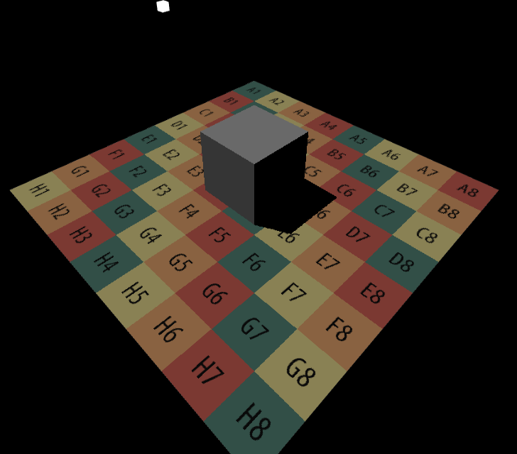  

### Screen Space Ray Tracing

`SSR`就是在屏幕空间上做实时全局光照的一种方法。也就是在屏幕空间做`Ray Tracing`，而且我们不需要知道三维物体的三角形以及加速结构等，只需要屏幕空间的信息即`Gbuffer`的内容就可以完成`Ray Tracing`，也就是得到场景最外的一层壳，然后和这层壳求交。碰到交点后，还要算交点对`ShadingPoint`的贡献。  

具体实现步骤如下图所示：  
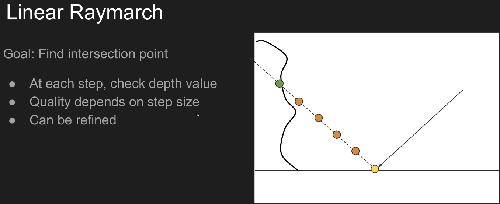  
根据`BRDF`的`lobe`，生成一根或多根光线，我们假设这里是镜面反射，那就只需要考虑一根反射光线，然后以固定步长沿着反射光线进行步进，每次步进都需要检查步进后光线的深度和场景的深度，直到光线深度大于等于场景深度，就获取该交点处的`albedo`，然后根据渲染方程进行`Shading`：  
```cpp
bool RayMarch(vec3 ori, vec3 dir, out vec3 hitPos) {
  float step = 0.02;
  const int totalStepTimes = 1000; 
  int curStepTimes = 0;
  vec3 stepDir = normalize(dir) * step;
  vec3 curPos = ori;
  for(int curStepTimes = 0; curStepTimes < totalStepTimes; curStepTimes++)
  {
    float curDepth = GetDepth(curPos);
    vec2 curScreenUV = GetScreenCoordinate(curPos);
    float gBufferDepth = GetGBufferDepth(curScreenUV);

    if(curDepth - gBufferDepth > 0.0001){
      hitPos = curPos;
      return true;
    }
    //o + t * d
    curPos += stepDir;
  }
  return false;
}
// test Screen Space Ray Tracing 
vec3 EvalReflect(vec3 wi, vec3 wo, vec2 uv) {
  vec3 worldNormal = GetGBufferNormalWorld(uv);
  vec3 relfectDir = normalize(reflect(-wo, worldNormal));
  vec3 hitPos;
  if(RayMarch(vPosWorld.xyz, relfectDir, hitPos)){
      vec2 screenUV = GetScreenCoordinate(hitPos);
      return GetGBufferDiffuse(screenUV);
  }
  else{
    return vec3(0.0);
  }
}
//test
L = EvalReflect(wi,wo,screenUV);
```
当然我们这里只是测试`SSR`是否能正常工作，没有考虑渲染方程，所以这里`EvalReflect`只是简单的返回交点处的`Albedo`。一切正常的话就会得到下面的图片：  
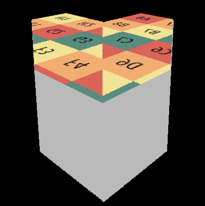  

### 间接光照  

有了上面的基础，间接光照就是直接算渲染方程的积分值。  
在算积分之前，我们需要知道采样方向以及它的`Pdf`，然后用蒙特卡洛积分来计算。这里对于兰伯特材质直接使用`Cos-weighted`采样。其过程如下：  
使用`Cos-weighted`采样，意味着`Pdf`和`Cos`项成正比，即`pdf(w)=c*cosθ`，则：  
$$
\begin{align}
& \int_{\Omega^+}pdf(w)dw=1 \\
& \int_{\Omega^+}c\cdot\cos\theta dw=1 \\
& \int_{0}^{2\pi}\int_{0}^{\pi/2}c\cdot\cos\theta\sin\theta d\theta d\phi \\
& =\int_{0}^{2\pi}\int_{0}^{\pi/2}c\cdot\sin\theta d\sin\theta d\phi \\
& =\int_{0}^{2\pi}c\cdot \frac{\sin^2\theta}{2}\vert_{0}^{\pi/2} d\phi \\
& =c\cdot\pi \tag{3}
\end{align}
$$
则c=1/π，pdf=cosθ/π。采样方向还是用逆变换采样的方式来获取：  
分别求其边缘概率密度函数：  
$$
\begin{align}
& p(\theta)=\int_{0}^{2\pi}\frac{\cos\theta\sin\theta}{\pi}d\phi \\
& =2\cos\theta\sin\theta \\
& p(\phi)=\int_{0}^{\pi/2}\frac{\cos\theta\sin\theta}{\pi}d\theta \\
& =\frac{\sin^2\theta}{2\pi}\vert_{0}^{\pi/2} \\
& =\frac{1}{2\pi} \tag{4}
\end{align}
$$
分别求其累积分布函数：  
$$
\begin{align}
& P(\theta)=\int_{0}^{\theta}2\cos\theta\sin\theta d\theta \\
& =\sin^2\theta \\
& =1-\cos^2\theta \\
& P(\phi)=\int_{0}^{\phi}\frac{1}{2\pi}d\phi \\
& =\frac{\phi}{2\pi} \tag{5}
\end{align}
$$
均匀的从`U[0,1]`中取出两个随机数$X_{1}$和$X_{2}$,则我们要的采样`θ`和`φ`为：  
$$
\begin{align}
& \theta=\arccos(\sqrt{1-X_1}) \\
& \phi=2\pi X_2 \tag{6}
\end{align}
$$
则采样方向vec(x,y,z)为：  
$$
\begin{align}
& x=\sin\theta\cos\phi=\sqrt{X_1}\cos(2\pi X_2) \\
& y=\sin\theta\sin\phi=\sqrt{X_1}\sin(2\pi X_2) \\
& z=\cos\theta=\sqrt{1-X_1} \tag{7}
\end{align}
$$
对应代码如下：  
```cpp
vec3 SampleHemisphereCos(inout float s, out float pdf) {
  vec2 uv = Rand2(s);
  float z = sqrt(1.0 - uv.x);
  float phi = uv.y * TWO_PI;
  float sinTheta = sqrt(uv.x);
  vec3 dir = vec3(sinTheta * cos(phi), sinTheta * sin(phi), z);
  pdf = z * INV_PI;
  return dir;
}
```
获得的采样方向还需要通过TBN矩阵将其从切线空间转换到世界空间，有了采样方向和`Pdf`，用蒙特卡洛公式计算积分值：  
$$
\begin{align}
L_o(p,w_o)\approx\frac{1}{N}\sum_{k=1}^{N}\frac{L_{i}(p,w_{i})f_{r}(p,w_{i},w_{o})\cos(\theta_{i})}{p(w_{i},w_{o})} \tag{8}
\end{align}
$$
代码实现如下：  
```cpp
//直接光照
//L = V * Le * brdf * cos
vec3 L_Normal = GetGBufferNormalWorld(screenUV);
L = EvalDiffuse(screenUV) * EvalDirectionalLight(screenUV) * max(0., dot(L_Normal, wi));
//间接光
vec3 L_ind = vec3(0.0);
for(int i = 0; i < SAMPLE_NUM; i++){
  float pdf;
  vec3 localDir = SampleHemisphereCos(s, pdf);
  vec3 L_ind_Normal = GetGBufferNormalWorld(screenUV);
  vec3 b1, b2;
  LocalBasis(L_ind_Normal, b1, b2);
  vec3 dir = normalize(mat3(b1, b2, L_ind_Normal) * localDir);
  //world space pos
  vec3 hitPos;
  if(RayMarch(worldPos, dir, hitPos)){
    vec2 hitScreenUV = GetScreenCoordinate(hitPos);
    //castRay =  V * Le * brdf * cos.
    vec3 hitNormal = GetGBufferNormalWorld(hitScreenUV);
    vec3 castRay = EvalDiffuse(hitScreenUV) * EvalDirectionalLight(hitScreenUV) * max(0., dot(hitNormal, wi));
    //L_ind += castRay * brdf * cos / pdf
    L_ind += castRay * EvalDiffuse(screenUV) * max(0., dot(L_ind_Normal, dir)) / pdf;
  }
}
L_ind /= float(SAMPLE_NUM);
L = L + L_ind;
```
如果一切顺利，`World Space Ray Marching SSR`的效果如下：  
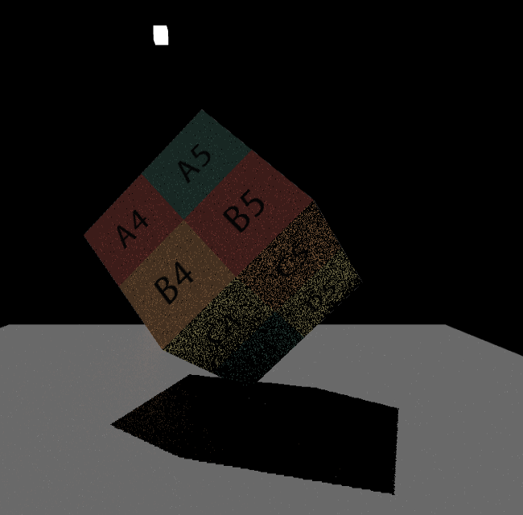  
要想得到不错的效果需要用实时光追降噪或者提高采样数量，读者可以自己学完实时光追降噪后应用于此，我电脑不行就不折腾了。下面是洞穴的效果：  
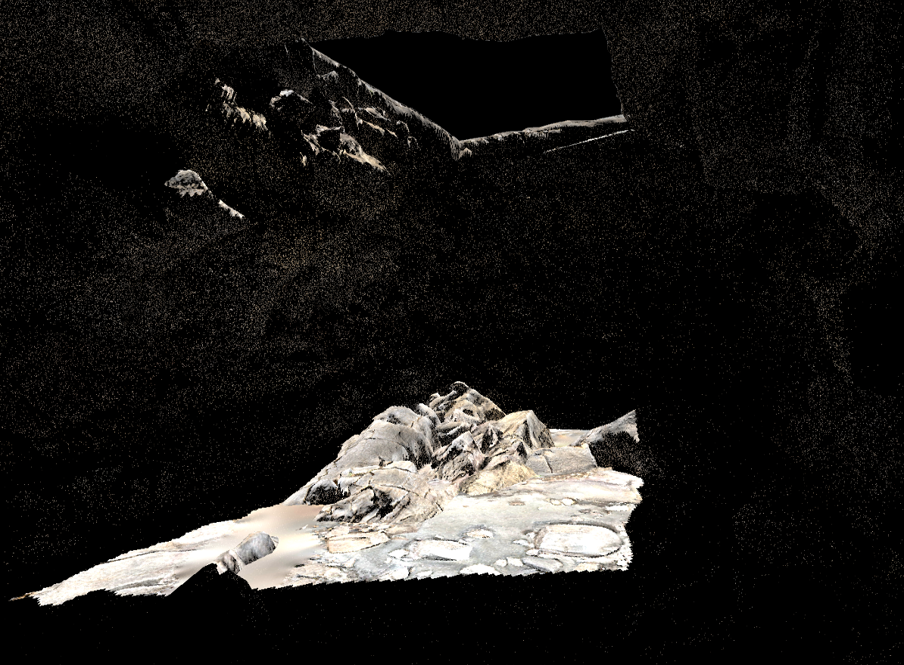  

## Efficient GPU SSR  

### Digital Differential Analyzer  

`Efficient GPU SSR`的核心思想是`DDA`(Digital Differential Analyzer)，该算法是用数值方法求解微分方程。  
我们简单回顾一下`DDA`思想：  
给定理想直线的起点坐标为$P_0(x_0,y_0)$终点坐标为$P_1(x_1,y_1)$，用斜截式表示的直线方程为：  
$$
\begin{align}
y=kx+b \tag{9}
\end{align}
$$
其中直线的斜率为$k=\frac{\Delta y}{\Delta x}$，$\Delta x=x_1-x_0$为水平方向位移，$\Delta y=y_1-y_0$为垂直方向位移，b为y轴上的截距。  
在DDA算法中，常根据$\Delta x$和$\Delta y$的大小来确定绘图的主位移方向，在主位移方向上执行的是$\pm 1$，选定$\Delta$较大方向为主方向使得斜率k满足$0\leq k\leq1$（若δy大于δx则交换它们的值）：  
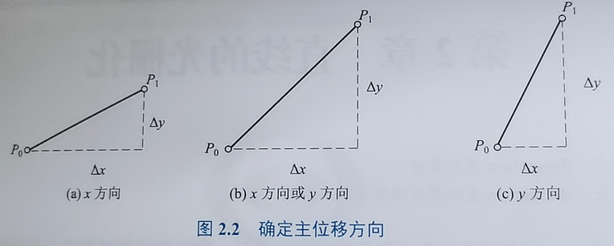  
确定主方向后，上面9式的微分表示为： 
$$
\begin{align}
\frac{\text{d}y}{\text{d}x}=\frac{\Delta y}{\Delta x}=\frac{\delta y}{\delta x}=k \tag{10}
\end{align}
$$
其有限差分近似解为：  
$$
\begin{equation}
\left\lbrace
\begin{align}
& x_{i+1}=x_i+\delta x=x_i+1 \\
& y_{i+1}=y_i+\delta y=y_i+k\delta x=y_i+k
\end{align}
\right.
\end{equation}
$$
$\Delta x$每次步进一个像素，根据上一次的点位$(x_i，y_i)$就可以确定当前的点$(x_{i+1},y_{i+1})$。最后将求得的点位进行$\text{int}(y_{i+1}+0.5)$取整即可得到对应的像素。
最后得到的效果如图：  
  

### An Efficient GPU DDA Solution

对于`3D`空间中大多数反射光线，`3D`线性采样并不等同于`2D`线性采样，如下图所示。因此，即使步长已经取的很小，一次步进可能也会跳过屏幕上的多个像素点（这里是误差的主要来源），而且会出现多次步进都是对同一个像素点采样的情况（低效的主要原因）。  
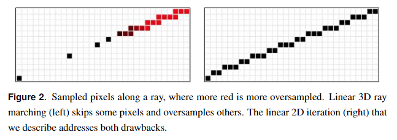  
右边的效果是我们这一节的主要内容。

重点是`RayMarching`函数，该函数的输入是`ViewSpace`下的反射方向以及它的起点，为了方便这里还是以纯镜面反射为例，全局光照参考`World Space Ray Marching SSR`可以实现。获取这两个参数的代码如下：  
```cpp
vec3 EvalReflect(vec3 wo,vec2 screenUV) {
  vec3 normalWS = GetGBufferNormalWorld(screenUV);
  vec3 reflectDir = normalize(reflect(-wo,normalWS));
  vec3 rayOriginWS = vPosWorld.xyz;
  vec3 rayEndWS = rayOriginWS + reflectDir * 1.0;
  vec3 rayOriginVS = projectToViewSpace(rayOriginWS);
  vec3 rayEndVS    = projectToViewSpace(rayEndWS);
  vec3 reflectDirVS = normalize(rayEndVS - rayOriginVS);
  Ray ray;
  ray.Origin = rayOriginVS;
  ray.Direction = reflectDirVS;

  Result result = RayMarching(ray);
  if(result.IsHit){
    return GetGBufferDiffuse(result.UV / vec2(windowWidth,windowHeight)).xyz;
	}
  else{
    return vec3(0.0);
  }
}
```
`3D`线段光栅化与`2D`线段光栅化非常相似。光栅化可以很容易地沿迭代方向对任何属性进行线性插值。如果属性处于齐次空间，则结果将线性插值`3D`空间中对应的属性值。具体来说，设点`Q`为射线上的一个`3D`点，`H = M·(Q,1)`为其左乘透视投影矩阵`M`的齐次透视投影。属性`k = 1/(H·(0,0,0,1))`和`Q·k`可以在`2D`中线性插值。因此，如果把该点和齐次`w`的倒数看作是沿`2D`线的函数，那么`∂(Q·k) / ∂x`，`∂k / ∂x`，`∂(Q·k) / ∂y`，和`∂k / ∂y`在屏幕空间中都是常数。  

其中`∂(Q·k) / ∂x`，`∂k / ∂x`，`∂(Q·k) / ∂y`，和`∂k / ∂y`是函数`Q·k`的偏微分表示。  
`∂(Q·k) / ∂x`表示函数 Q·k 对 x 的偏微分，即改变 x 时 Q·k 的变化情况。  
`∂k / ∂x`表示函数 k 对 x 的偏微分，即改变 x 时 k 的变化情况。  
`∂(Q·k) / ∂y`表示函数 Q·k 对 y 的偏微分，即改变 y 时 Q·k 的变化情况。  
`∂k / ∂y`表示函数 k 对 y 的偏微分，即改变 y 时 k 的变化情况。  

在任意`2D`线段上的点$Q(x，y)$，其对应的三维点为$Q'$:  
$$
\begin{align}
& Q'(x,y)=\frac{(Q·k)(x,y)}{k(x,y)} \\
& Q'(z)=\frac{(Q·k)(z)}{k(z)} \tag{11}
\end{align}
$$
有了3D深度信息后，我们就可以和Gbuffer中的深度信息进行比对了。在此之前我们需要知道`∂(Q·k) / ∂x`，`∂k / ∂x`偏微分的数值表示，而Gbuffer中的深度信息读取需要另一个偏微分`∂y / ∂x`。  

在上面有提到在线性情况下，偏微分的值都是常数，则：  
$$
\begin{align}
& \frac{∂(Q·k)}{∂x}=\frac{\Delta(Q·k)}{\Delta x}=\frac{\delta (Q·k)}{\delta x}=dQ \\
& \frac{∂k}{∂x}=\frac{\Delta k}{\Delta x}=dK \\
& \frac{∂y}{∂x}=\frac{\Delta y}{\Delta x}=dP \tag{12}
\end{align}
$$
为了方便这里常数分别取名为`dQ`，`dK`，`dP`。有了这些信息后，我们想要的属性就可以通过增量来算得了，假设`Q`为`(Q·k)`的别名，则$Q_{i+1}.z=Q_i.z+δQ_i.z=Q_i.z+\delta x\cdot dQ$，其中`δx==1`，相应的$k_{i+1}=k_i+dK$。  
代码实现如下：  
```cpp
struct Result
{
  bool IsHit;
  vec2 UV;
  ...
};
bool Query(float depth, vec2 uv)
{
  float depth1 = -LinearizeDepth(texelFetch(uGDepth,ivec2(uv),0).r);
  return depth < depth1;
}
//DDA,数值方法求解微分方程的算法
Result RayMarching(Ray ray)
{
	Result result;
  //endPos 不能超出近平面，否则反射出的颜色是错误的。超过的话origin沿dir到近平面的距离 = origin到近平面的最短距离 / cosθ，cosθ = dir.z / r;
  float rayLength = ((ray.Origin.z + ray.Direction.z * maxDistance) > -uZBufferParams.x) ?
  (-uZBufferParams.x - ray.Origin.z) / ray.Direction.z : maxDistance;

	vec3 V0 = ray.Origin;
	vec3 V1 = ray.Origin + ray.Direction * rayLength;
  //将viewSpace下的origin和endPos转到ClipSpace
	vec4 H0 = projectToClipSpace(V0);
	vec4 H1 = projectToClipSpace(V1);

	float k0 = 1.0 / H0.w;
  float k1 = 1.0 / H1.w;
	vec3 Q0 = V0 * k0; 
  vec3 Q1 = V1 * k1;

	// NDC-space
  vec2 P0 = H0.xy * k0;
  vec2 P1 = H1.xy * k1;
	vec2 Size = vec2(windowWidth,windowHeight);
	//Screen Space
	P0 = (P0 + 1.0) / 2.0 * Size;
	P1 = (P1 + 1.0) / 2.0 * Size;

	vec2 Delta = P1 - P0;

  //是否重新排序，我们只处理Delta较大情况
	bool Permute = false;
  if (abs(Delta.x) < abs(Delta.y)) { 
      Permute = true;
      Delta = Delta.yx; P0 = P0.yx; P1 = P1.yx; 
  }
	float StepDir = sign(Delta.x);
  float Invdx = StepDir / Delta.x;
	
  //偏微分的数值表示法
  vec3  dQ = (Q1 - Q0) * Invdx;
  float dk = (k1 - k0) * Invdx;
  vec2  dP = vec2(StepDir, Delta.y * Invdx);
	float stride = 2.0;//可调
  dP *= stride; dQ *= stride; dk *= stride;
  float jitter = 1.0;//可调
  P0 += dP * jitter; Q0 += dQ * jitter; k0 += dk * jitter;
	
	float Step = 0.0;
	float MaxStep = 1000.0;
	float EndX = P1.x * StepDir;

	float k = k0;
	vec3 Q = Q0;
  vec2 P = P0;
	for(;((P.x * StepDir) <= EndX) && 
      Step < MaxStep;
      Step+=1.0,P += dP, Q.z += dQ.z, k += dk)
	{
		result.UV = Permute ? P.yx : P;
		float depth;
    //At any 2D point (x,y), the corresponding 3D point is Q‘(x,y)=(Q·k)(x,y) / k(x,y)，Q’(z)=(Q·k)(z) / k(z)
		depth = Q.z / k;
		if(result.UV.x > windowWidth || result.UV.x < 0.0 || result.UV.y > windowHeight || result.UV.y < 0.0)
			break;
		result.IsHit = Query(depth, result.UV);
    if (result.IsHit)
			break;
	}
	return result;
}
```
其中需要注意的一点是，`rayLength`光线的长度不能超过近平面，否则会出错，光线长度超出了近平面的范围则用下面等式进行约束:    
`origin沿dir到近平面的距离 = origin到近平面的最短距离 / cosθ`，`cosθ = dir.z / r`（cartesian to spherical in tangent space）。  
如果一切顺利，将会得到下面效果图：  
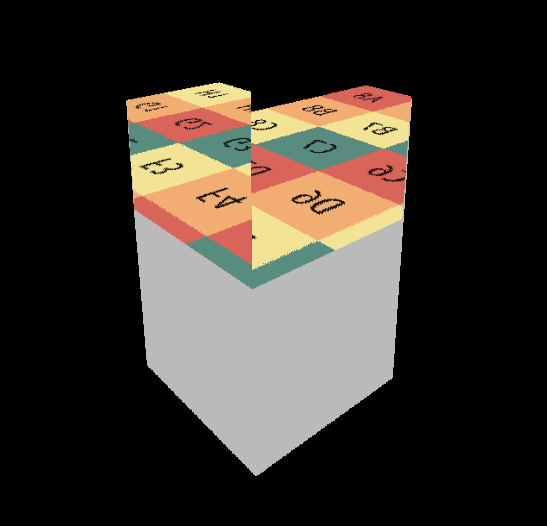  

## Hierarchical-Z SSR  

`Hi-Z`是为了优化线性步进的算法，因为步长是固定的，但是大部分时间都浪费在了没有碰撞的空间中。  
  
而`Hi-Z`会根据试探步来判断下一次步长的距离，如果试探步没有与场景相交，那下一次步进的距离就更大，这样求得的交点所使用的步进次数更少，在保证准确率的情况下，效率也得到了极大的提升！  

`Hi-Z`方法创建了一个`Depth Mipmap`加速结构，称为`Hi-Z buffer`。该结构本质上是场景深度的四叉树，其中每个四叉树层级中的每个单元格都被设置为上一层级中`4`个单元格的最小值（或最大值，取决于z轴方向）。  
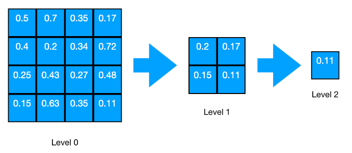  
值得注意的是，如果行或列不是偶数，采样需要额外多加一列或一行，如果都是奇数，那么还要额外多考虑一个右上角的像素，如图：  
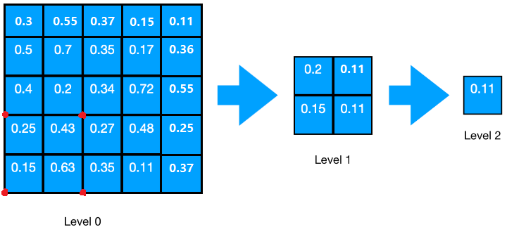  
这部分代码比较散就不列出来了，理解了这个过程，实现就不难了。  
`Depth Mipmap`可以用另一个`Pass`来看每一层效果，效果如下：  
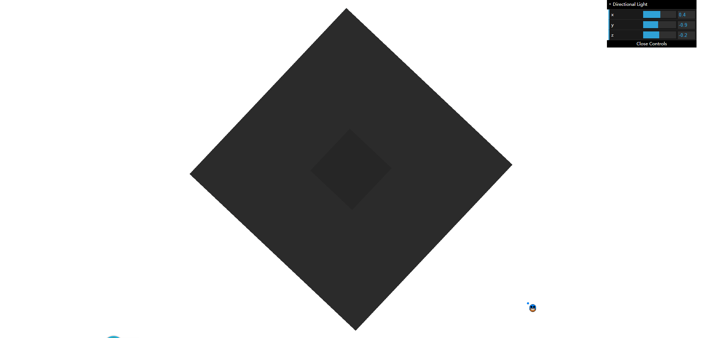  
越黑表示越近，纯白色就是深度为`1.0`的情况无限远。  

有了`Depth Mipmap`，我们还需要屏幕空间的起点和方向。获取这些数据的过程和上一节差不多，代码实现如下：  
```cpp
vec3 EvalReflect(vec3 wo,vec2 screenUV) {
  //从世界坐标中恢复Ts中的原点和反射方向
  vec3 normalWS = GetGBufferNormalWorld(screenUV);
  vec3 reflectDir = normalize(reflect(-wo,normalWS));
  vec3 rayOriginWS = vPosWorld.xyz;
  vec3 rayEndWS = rayOriginWS + reflectDir * 1.0;
  vec3 rayOriginVS = projectToViewSpace(rayOriginWS);
  vec3 rayEndVS    = projectToViewSpace(rayEndWS);
  vec4 rayOriginCS = projectToClipSpace(rayOriginVS);
  vec4 rayEndCS    = projectToClipSpace(rayEndVS);
  rayOriginCS = rayOriginCS.xyzw / rayOriginCS.w;
  rayEndCS    = rayEndCS.xyzw / rayEndCS.w;
  vec3 rayOriginTS = (vec3(rayOriginCS) + 1.0) * 0.5;
  vec3 rayEndTS = (vec3(rayEndCS) + 1.0) * 0.5;
  vec3 reflectDirTS = normalize(rayEndTS - rayOriginTS);
  float outMaxDistance = reflectDirTS.x >= 0.0 ? (1.0 - rayOriginTS.x) / reflectDirTS.x  : -rayOriginTS.x / reflectDirTS.x;
  outMaxDistance = min(outMaxDistance, reflectDirTS.y < 0.0 ? (-rayOriginTS.y / reflectDirTS.y) : ( (1.0-rayOriginTS.y) / reflectDirTS.y));
  outMaxDistance = min(outMaxDistance, reflectDirTS.z < 0.0 ? (-rayOriginTS.z / reflectDirTS.z) : ((1.0-rayOriginTS.z)/reflectDirTS.z));
  SSRay ray;
  ray.rayPosInTS = rayOriginTS;
  ray.rayDirInTS = reflectDirTS;
  ray.maxDistance = outMaxDistance;

  vec3 hitPos;
  vec3 reflectedColor = vec3(0.);
  if(FindIntersection_HiZ(ray, hitPos)) {
    reflectedColor = GetGBufferDiffuse(hitPos.xy);
  }
  return reflectedColor;
}
```
这里`outMaxDistance`是防止反射终点超出屏幕而浪费性能。

接下来就是重头戏，`FindIntersection_HiZ`函数的实现。  
该函数核心地方就是试探步如何确定下次步进的距离，先说下这里试探步是怎么处理的，我先把相关代码贴出来，以便参考和解释。  
```cpp
vec3 intersectDepthPlane(in vec3 o, in vec3 d, float t){
  return o + d * t;
}
...
vec3 start = ss_ray.rayPosInTS;
vec3 rayDir = ss_ray.rayDirInTS;
float maxTraceDistance = ss_ray.maxDistance;
vec3 ray = start;
float minZ = ray.z;
float maxZ = ray.z + rayDir.z * maxTraceDistance;
float deltaZ = (maxZ - minZ);
vec3 o = ray;
vec3 d = rayDir * maxTraceDistance;
...
//步进起点所在单元格的GbufferDepth
float cell_minZ = getMinimumDepthPlane((oldCellIdx + 0.5) / cellCount, level);    
//试探步：步进起点的深度小于GbufferDepth，则步进到ray.z >= gbufferDepth的地方，这可能会导致新的tmpRay.xy超过1.0，所以这里只是试探步，实际步进是用intersectCellBoundary这个函数完成。
vec3 tmpRay = (cell_minZ > ray.z) ? intersectDepthPlane(o, d, (cell_minZ - minZ) / deltaZ) : ray;
```
以反射起点`ray`为例，我们假设这里`ray`已经向`rayDir`步进了一小段距离以防止自相交。我们先看下`intersectDepthPlane`这个函数，以公式`o+t*d`来确定步进后的点，需要注意的是，这里的`d`指代的是非单位向量，即：`光线终点 - 光线起点`。而`t`则是一个归一化的系数在`[0,1]`之间，有了`t`这个系数，这样我们就可以精确的得到起点沿光线步进后的点。  
下面用图例的形式进一步解释试探步：   
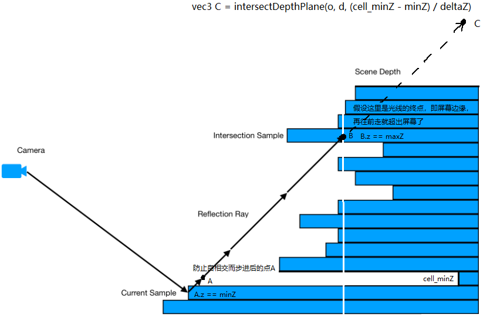  
可以看到如果起点`A`要试探地走一步，这一步有可能会直接跨出屏幕（假设白色线条代表屏幕的位置），或者跨过了多个像素，从而错过中间可能会相交的点。我们从试探步中得到的信息就是，它这一步是否跨过了起点`A`所在的像素，如果跨过了起点`A`所在的单元格(像素)，那我们就用另一个函数使得起点`A`步进到下一个单元格。需要注意的是这里的单元格和`Depth Mipmap`层级挂钩的，层级越大，一个单元格的步长就越大。  

下面我们解释一下如何让起点`A`步进到下一个单元格，还是先看下相关代码：  
```cpp
bool FindIntersection_HiZ(
  in SSRay ss_ray,
  out vec3 intersection
) {
  vec3 start = ss_ray.rayPosInTS;
  vec3 rayDir = ss_ray.rayDirInTS;
  float maxTraceDistance = ss_ray.maxDistance;

  vec2 crossStep = vec2(rayDir.x >= 0.0 ? 1.0 : -1.0, rayDir.y >= 0.0 ? 1.0 : -1.0);
  vec2 crossOffset = crossStep / vec2(windowWidth,windowHeight) / 128.;
  //假设reflectDir不与屏幕的宽高平行,如果是向前步进一个单元格的距离，boundary = (rayCell + crossStep )/ cell_count + crossOffset,其中crossOffset > 0.
  //如果是向后步进一个单元格的距离，boundary = (rayCell + vec(0,0) )/ cell_count + crossOffset,其中crossOffset < 0.
  crossStep = saturate(crossStep);

  vec3 ray = start;
  float minZ = ray.z;
  float maxZ = ray.z + rayDir.z * maxTraceDistance;
  float deltaZ = (maxZ - minZ);

  vec3 o = ray;
  vec3 d = rayDir * maxTraceDistance;

  int startLevel = 2;
  int stopLevel = 0;

  vec2 startCellCount = vec2(getCellCount(startLevel));
  //步进起点所在的单元格。
  vec2 rayCell = getCell(ray.xy, startCellCount);
  //防止自相交。
  ray = intersectCellBoundary(o, d, rayCell, startCellCount, crossStep, crossOffset * 128. * 2. );

  int level = startLevel;
  int iter = 0;
  ...

  while( level >= stopLevel && ray.z <= maxZ  && ++iter < 1000){
    //获取纹理分辨率
    vec2 cellCount = vec2(getCellCount(level));
    //步进起点所在的单元格索引
    vec2 oldCellIdx = getCell(ray.xy, cellCount);
    //步进起点所在单元格的GbufferDepth
    float cell_minZ = getMinimumDepthPlane((oldCellIdx + 0.5) / cellCount, level);
    if(cell_minZ == 1.0) return false;//解决SSR测试的问题
    //试探步：步进起点的深度小于GbufferDepth，则步进到ray.z >= gbufferDepth的地方，这可能会导致新的tmpRay.xy超过1.0，所以这里只是试探步，实际步进是用intersectCellBoundary这个函数完成。
    vec3 tmpRay = (cell_minZ > ray.z) ? intersectDepthPlane(o, d, (cell_minZ - minZ) / deltaZ) : ray;
    //此次试探步终点所在单元格的索引
    vec2 newCellIdx = getCell(tmpRay.xy, cellCount);
    //如果到了第0层级，那么说明马上快要到交点处了，比较深度差值，如果差值大于某个阈值（0.0017），我们还需要在当前层级步进一个单元格。
    float thickness = level == 0 ? (ray.z - cell_minZ) : 0.;
    //步进起点和终点不在同一个单元格为true。
    bool crossed  = (thickness > MAX_THICKNESS)|| crossedCellBoundary(oldCellIdx, newCellIdx);
    //步进：不在同一个单元格 则寻找最近的一个单元格进行步进,在同一个单元格则步进到试探步的地方。
    ray = crossed ? intersectCellBoundary(o, d, oldCellIdx, cellCount, crossStep, crossOffset) : tmpRay;
    //不在同一个单元格 则步进距离再次增大，在同一个单元格则距离减小。
    level = crossed ? min(MAX_MIPMAP_LEVEL, level + 1): level - 1;
  }
  ...
}
```
可以看到我们用`tmpRay`接收了试探步的位置。下面则是通过`crossedCellBoundary(oldCellIdx, newCellIdx)`来判断`tmpRay`是否和起点`A`在相同单元格。如果不在同一个单元格则`crossed`为`true`，我们需要用`intersectCellBoundary`来使起点`A`步进到下一个单元格。`intersectCellBoundary`函数的代码实现如下：  
```cpp
vec3 intersectCellBoundary(
  vec3 o, 
  vec3 d, 
  vec2 rayCell, 
  vec2 cell_count, 
  vec2 crossStep, 
  vec2 crossOffset
){
  //光线所在单元格的下一个单元格
  vec2 index = rayCell + crossStep;
  //下一个单元格的边界，根据当前level的单元格数量决定
  vec2 boundary = index / cell_count;
  //边界偏移一点，防止步进时落在边界上。
  boundary += crossOffset;
  //步进的距离
  vec2 delta = boundary - o.xy;
  //标准化
  delta /= d.xy;
  //选择最小被标准化后的步进值，代表朝着 离现在光线所在单元格最近的一个单元格 步进
  float t = min(delta.x, delta.y);
  //步进后的点
  return intersectDepthPlane(o, d, t);
}
```
我们看下这个函数相关的参数，`o`为步进起点的位置,`d`为非单位向量,`rayCell`为起点A所在的单元格,`cell_count`为当前Depth Mipmap层级的分辨率,`crossStep`为该单元格向下一个单元格步进的向量,`crossOffset`为微小偏移防止步进后的点落在边界上。下面我还是用图例的形式进一步解释这个函数如何工作的，这里我们忽略z值：  
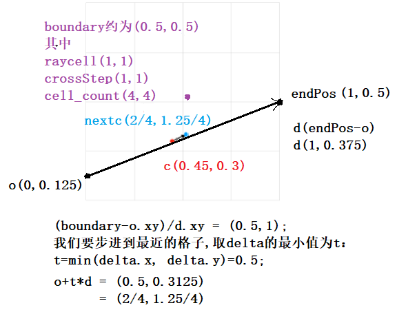  
这里`o(0,0.125)`为光线起点，`endPos(1,0.5)`为光线终点，`c(0.45,0.3)`为步进起点，我们要求的点为`nextc`。光线起点`c`所在的单元格`rayCell(1,1)`，这里因为`d(1,0.375)`的两个分量都大于零所以`crossStep`为`(1,1)`，`cell_count`则是当前层级的分辨率为`(4,4)`。  
`rayCell`根据`crossStep`，移动到下一个单元格，即紫色点所在位置（这里忽略了偏移值）。然后除以`cell_count`得到它们的相对位置即`boundary(0.5,0.5)`。  
再通过公式`(boundary - o.xy) / d.xy`来确定归一化的系数`t`，通过图例和计算我们很容易的观察到，此时`x`分量的系数`t`是`y`分量的`0.5`倍，即光线`d`需要走到`endPos`，`nextc`的`y`分量才和`boundary`的`y`分量相等，而这并不是我们想要的，所以我们这里选择系数相对较小的来步进，这样通过公式`o+t*d`就可以准确得到步进到下一个单元格的相对坐标了（这里红色点和蓝色点应该在光线`d`上面，这里为了取值方便没有画在一起）。  
同理当步进起点向反方向步进时，将`o`和`endPos`反过来，并且`crossStep`为`(0,0)`时也可以得到步进后的点，这里就不再解释了。  

还有最后一件事情没做，我们上面讨论的情况只适用于向前追踪，如果向后追踪，即向`nearPlane`步进，直接用上面的算法会出错。这是因为试探步函数`intersectDepthPlane(o, d, (cell_minZ - minZ) / deltaZ)`，处理不了向后步进的情况，我们看下这个`cell_minZ`变量，如果是向后步进，这个变量的值只会一直递减，相应的系数`t`也会一直递减，从而无法完成试探步 步进的工作。但是幸运的是，向后追踪的情况比向前追踪简单，我们只需要用一个方向布尔变量来控制算法流程。  
在每次迭代中，我们得到了步进起点所对应的`Depth Mipmap`场景深度`cell_minZ`，当场景深度大于步进起点深度时，我们就调用`intersectCellBoundary`来步进到下一个单元格，而不需要经过试探步来决定。  
整个`Hi-z`算法代码实现如下：   
```cpp
bool FindIntersection_HiZ(
  in SSRay ss_ray,
  out vec3 intersection
) {
  vec3 start = ss_ray.rayPosInTS;
  vec3 rayDir = ss_ray.rayDirInTS;
  float maxTraceDistance = ss_ray.maxDistance;

  vec2 crossStep = vec2(rayDir.x >= 0.0 ? 1.0 : -1.0, rayDir.y >= 0.0 ? 1.0 : -1.0);
  vec2 crossOffset = crossStep / vec2(windowWidth,windowHeight) / 128.;
  //假设reflectDir不与屏幕的宽高平行,如果是向前步进一个单元格的距离，boundary = (rayCell + crossStep )/ cell_count + crossOffset,其中crossOffset > 0.
  //如果是向后步进一个单元格的距离，boundary = (rayCell + vec(0,0) )/ cell_count + crossOffset,其中crossOffset < 0.
  crossStep = saturate(crossStep);

  vec3 ray = start;
  float minZ = ray.z;
  float maxZ = ray.z + rayDir.z * maxTraceDistance;
  float deltaZ = (maxZ - minZ);

  vec3 o = ray;
  vec3 d = rayDir * maxTraceDistance;

  int startLevel = 2;
  int stopLevel = 0;

  vec2 startCellCount = vec2(getCellCount(startLevel));
  //步进起点所在的单元格。
  vec2 rayCell = getCell(ray.xy, startCellCount);
  //防止自相交。
  ray = intersectCellBoundary(o, d, rayCell, startCellCount, crossStep, crossOffset * 128. * 2. );

  int level = startLevel;
  int iter = 0;
  bool isBackwardRay = rayDir.z < 0.;
  float Dir = isBackwardRay ? -1. : 1.;
  while( level >= stopLevel && ray.z * Dir <= maxZ * Dir && ++iter < 1000){
    //获取纹理分辨率
    vec2 cellCount = vec2(getCellCount(level));
    //步进起点所在的单元格索引
    vec2 oldCellIdx = getCell(ray.xy, cellCount);
    //步进起点所在单元格的GbufferDepth
    float cell_minZ = getMinimumDepthPlane((oldCellIdx + 0.5) / cellCount, level);
    if(cell_minZ == 1.0) return false;//解决SSR测试的问题
    //试探步：步进起点的深度小于GbufferDepth，则步进到ray.z >= gbufferDepth的地方，这可能会导致新的tmpRay.xy超过1.0，所以这里只是试探步，实际步进是用intersectCellBoundary这个函数完成。
    vec3 tmpRay = ((cell_minZ > ray.z) && !isBackwardRay) ? intersectDepthPlane(o, d, (cell_minZ - minZ) / deltaZ) : ray;
    //此次试探步终点所在单元格的索引
    vec2 newCellIdx = getCell(tmpRay.xy, cellCount);
    //如果到了第0层级，那么说明马上快要到交点处了，比较深度差值，如果差值大于某个阈值（0.0017），我们还需要在当前层级步进一个单元格。
    float thickness = level == 0 ? (ray.z - cell_minZ) : 0.;
    //步进起点和终点不在同一个单元格为true。
    bool crossed  = (isBackwardRay && (cell_minZ > ray.z))||(thickness > MAX_THICKNESS)|| crossedCellBoundary(oldCellIdx, newCellIdx);
    //步进：不在同一个单元格 则寻找最近的一个单元格进行步进,在同一个单元格则步进到试探步的地方。
    //前向追踪不适合用在后向追踪，如果是backwardRay，没有试探步。cell_minZ > ray.z为true则步进到下一个单元格level + 1，false则保留当前状态level - 1；
    ray = crossed ? intersectCellBoundary(o, d, oldCellIdx, cellCount, crossStep, crossOffset) : tmpRay;
    //不在同一个单元格 则步进距离再次增大，在同一个单元格则距离减小。
    level = crossed ? min(MAX_MIPMAP_LEVEL, level + 1): level - 1;
  }
  bool intersected = (level < stopLevel);
  intersection = intersected ? ray : vec3(0.0);
  return intersected;
}
```
这里`thickness`是为了让光线穿过物体。不然我们会得到一些错误的结果。  

这节的内容将的有点`HighLevel`，更多细节可以参考[Hierarchical-Z SSR](https://sugulee.wordpress.com/2021/01/19/screen-space-reflections-implementation-and-optimization-part-2-hi-z-tracing-method/)。  
如果一切顺利，就会得到下面的效果：  
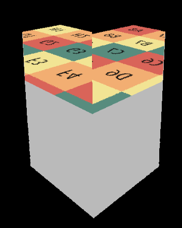  
全局光照如何处理在上面`World Space Ray Marching SSR`已经讲过，这里只需要照着做就行。