# 最终效果图  
每组下面一排球是没用`Kulla Conty`的对照组，所有球的金属度都为`1`,粗糙度最小`0.05`，最大`0.95`,可以明显看到对照组随着粗糙度增大，会越来越暗，而使用了`Kulla Conty`的实验组，亮度不会随着粗糙度的增加而衰减，为了使现象更明显这里吧`HDR tonemapping`功能禁用了！
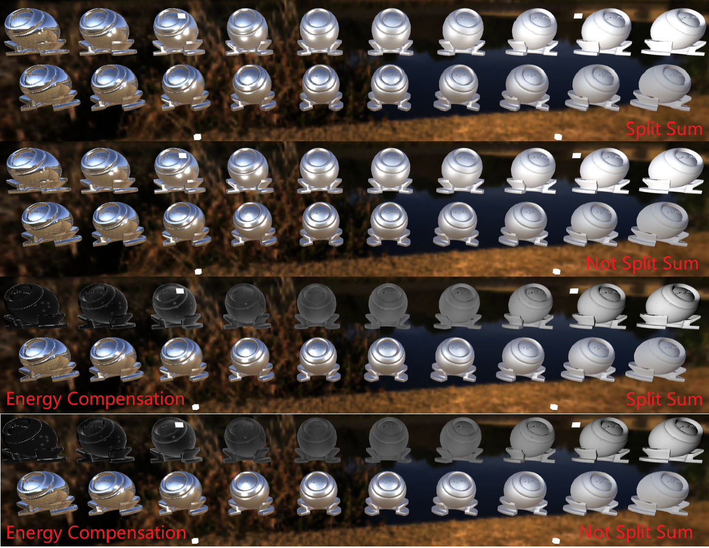  
下面是金材质的`Kulla-Conty Approximation`效果：  
  

# 作业总览  

1. 实现预计算$E(\mu)$
2. 实现预计算$E_{avg}$
3. 正确实现PBR材质
4. 正确实现Kulla-Conty材质
5. 提高1：实现重要性采样的预计算方法   
6. 提高2：在预计算$E(\mu)$时，使用`Split Sum`完成预计算工作   

个人扩展部分：`Image Based Lighting`

# 源码  

暂未公开

# Webgl代码框架的理解  

这部分代码主要解释我们需要的地方，太过于细节的地方本节内容不做解释，只去理解那些能帮助我实现想要效果的代码。  

## 模型加载  

``` js
let pbrSphere1Transform = setTransform(360, 0, 0, 180, 180, 180, 0, Math.PI, 0);
	loadGLTF(renderer, 'assets/ball/', 'ball', 'PBRMaterial', pbrSphere1Transform,irradianceMap,prefilterMap,pbrBrdfLutObj,metallic,0.95);
function loadGLTF(renderer, path, name, objMaterial, transform,irradianceMap,prefilterMap,pbrBrdfLut, metallic=1.0, roughness=0.2){
    ...
	new THREE.GLTFLoader(manager)
		.setPath(path)
		.load(name + '.gltf', function (gltf) {
			gltf.scene.traverse(function (child) {
				if (child.isMesh) {
                    ...
					let colorMap = new Texture(renderer.gl);
					...
                    //gold : 0.94423,0.77611,0.37217
                    let kd = [1.00,1.00, 1.00]; //albedo
                    colorMap.CreateConstantTexture(renderer.gl, kd, true);
					let material;
					switch (objMaterial) {
						case 'KullaContyMaterial':
							material = buildKullaContyMaterial(colorMap,metallic,roughness,irradianceMap,prefilterMap,pbrBrdfLut,kullaContyBrdflut,kullaContyEavglut,"./src/shaders/kullaContyShader/KullaContyVertex.glsl", "./src/shaders/kullaContyShader/KullaContyFragment.glsl");
							break;
						case 'PBRMaterial':
							material = buildPBRMaterial(colorMap,metallic,roughness,irradianceMap,prefilterMap,pbrBrdfLut,"./src/shaders/pbrShader/PBRVertex.glsl", "./src/shaders/pbrShader/PBRFragment.glsl");
							break;
					}
					material.then((data) => {
						let meshRender = new MeshRender(renderer.gl, mesh, data,objMaterial);
						renderer.addMeshRender(meshRender);
					});
				}
			});
		});
}
```
模型加载主要就看这部分，打了省略的部分不需要去理解。  
`colorMap`获取创建的纹理`ID`,`kD`是`albedo`，只为了观察能量损失和补充直接填`1.0`就行，`CreateConstantTexture`用`albedo`创建一张宽高为`1`的纹理。  
`buildKullaContyMaterial`是一个异步函数，函数执行完成后就会进入回调部分`material.then((data))`,`data`才是函数的返回值。  
`child.isMesh`会判断模型的子节点是否为`mesh`节点，经过`debug`发现，该`ball`模型有`4`个子节点，也就说会进入回调部分`material.then((data))`4次。  

## shader编译  

在理解框架`shader`编译之前需要把材质类型熟悉一下，以`PBRMaterial.js`为例:  
``` js
class Material {
    #flatten_uniforms;
    #flatten_attribs;
    #vsSrc;
    #fsSrc;
    // Uniforms is a map, attribs is a Array
    constructor(uniforms, attribs, vsSrc, fsSrc, frameBuffer) {
        this.uniforms = uniforms;
        this.attribs = attribs;
        this.#vsSrc = vsSrc;
        this.#fsSrc = fsSrc;

        this.#flatten_uniforms = ['uViewMatrix','uModelMatrix', 'uProjectionMatrix', 'uCameraPos', 'uLightPos'];
        for (let k in uniforms) {
            this.#flatten_uniforms.push(k);
        }
        this.#flatten_attribs = attribs;
        this.frameBuffer = frameBuffer;
    }
    setMeshAttribs(extraAttribs) {
    
        for (let i = 0; i < extraAttribs.length; i++) {
            this.#flatten_attribs.push(extraAttribs[i]);
        }
    }
    compile(gl) {
        return new Shader(gl, this.#vsSrc, this.#fsSrc,
            {
                uniforms: this.#flatten_uniforms,
                attribs: this.#flatten_attribs
            });
    }
}
class PBRMaterial extends Material {
    constructor(albedo, metallic,roughness,irradianceMap,prefilterMap,pbrBrdfLut, vertexShader, fragmentShader) {
        super({
            'uAlbedoMap':          { type: 'texture', value: albedo },
            'uMetallic':        { type: '1f', value: metallic },
            ...
            // 'uLightPos[4]': { type: '3fv', value: null },
            // 'uLightColors[4]': { type: '3fv', value: null },
        }, [], vertexShader, fragmentShader);
    }
}
async function buildPBRMaterial(albedo, metallic,roughness,irradianceMap,prefilterMap,pbrBrdfLut, vertexPath, fragmentPath) {
    let vertexShader = await getShaderString(vertexPath);
    let fragmentShader = await getShaderString(fragmentPath);
    return new PBRMaterial(albedo, metallic,roughness,irradianceMap,prefilterMap,pbrBrdfLut, vertexShader, fragmentShader);
}
```
各种材质类都是继承自父类`Material`,子类部分只负责填写对应`shader`需要`uniform`的变量，子类用`super`关键字来对父类进行初始化，随后填写`uniform`数据全部被保存入父类私有变量`#flatten_uniforms`中，父类还包含了一些常用`uniform`变量`'uViewMatrix','uModelMatrix'...`,这些名字在不同的`vertex`和`fragment`中名字都是统一的,可自行修改，数组`uniform`变量需要自己手动设置，框架没有对这类变量进行解析。  
`this.#vsSrc`和`this.#fsSrc`保存的`shader`文件路径，`#this.attribs`保存的`vertexShader`的`location`变量名字，比如:  
`layout (location = 0) in vec3 aVertexPosition;`中的`aVertexPosition`，所以在`vertexShader`中不要更改它的名字，名字都是来源于`mesh`节点，在`MeshRender.js`文件中会判断`mesh`节点是否包含该属性名字，有的话就调用该材质的`setMeshAttribs`函数将名字存入`#this.attribs`。  
在调用`compile()`函数的时候，`shader`路径，`uniform`变量名，`attribs`变量名字会一同传入`new`出来的`shader`对象。  
``` js
class Shader {
    constructor(gl, vsSrc, fsSrc, shaderLocations) {
        this.gl = gl;
        const vs = this.compileShader(vsSrc, gl.VERTEX_SHADER);
        const fs = this.compileShader(fsSrc, gl.FRAGMENT_SHADER);
        this.program = this.addShaderLocations({
            glShaderProgram: this.linkShader(vs, fs),
        }, shaderLocations);
    }
    compileShader(shaderSource, shaderType) {
        const gl = this.gl;
        var shader = gl.createShader(shaderType);
        ...
        return shader;
    };
    linkShader(vs, fs) {
        const gl = this.gl;
        var prog = gl.createProgram();
        ...
        return prog;
    };
    addShaderLocations(result, shaderLocations) {
        const gl = this.gl;
        result.uniforms = {};
        result.attribs = {};
        if (shaderLocations && shaderLocations.uniforms && shaderLocations.uniforms.length) {
            for (let i = 0; i < shaderLocations.uniforms.length; ++i) {
                result.uniforms = Object.assign(result.uniforms, {
                    [shaderLocations.uniforms[i]]: gl.getUniformLocation(result.glShaderProgram, shaderLocations.uniforms[i]),
                });
            }
        }
        if (shaderLocations && shaderLocations.attribs && shaderLocations.attribs.length) {
            for (let i = 0; i < shaderLocations.attribs.length; ++i) {
                result.attribs = Object.assign(result.attribs, {
                    [shaderLocations.attribs[i]]: gl.getAttribLocation(result.glShaderProgram, shaderLocations.attribs[i]),
                });
            }
        }
        return result;
    }
}
```
shader对象在构造函数中就完成了所有事情，`gl.createProgram()`这个函数返回shader的ID，该ID存储在`addShaderLocations()`这个函数中result对象里面，`{ glShaderProgram: this.linkShader(vs, fs) }`这里是对result对象的初始化，后面又加了两个成员变量`result.uniforms`和`result.attribs`。  
重点是这个函数`addShaderLocations()`,`result.uniforms`和`result.attribs`存储的是一系列键值对，`key`是之前传入的uniform变量名，`value`是location后得到ID,`result.attribs`同理。  
所以在`MeshRender`对象中，进行`gl.useProgram()`,`gl.uniform()`,`gl.enableVertexAttribArray()`操作时，只需要所以用变量名来索引`shader.program`的shaderID，uniformID,attribsID以及即可,该`program`就对应上面说的`result`的内容。  
知道这些以后我们就可以自行对shader进行`uniform`,和`useProgram`操作,对于需要手动设置`uniform变量`如下：  
``` js
for (let l = 0; l < this.lights.length; l++) {
    ...
    // Camera pass
    for (let i = 0; i < this.meshes.length; i++) {
        
        if(this.meshes[i].materialName == "KullaContyMaterial" || this.meshes[i].materialName == "PBRMaterial"){
            let ID = this.meshes[i].shader.program.glShaderProgram;
            this.gl.useProgram(ID);
            gl.uniform3fv(gl.getUniformLocation(
                ID, "uLightPos" + "[" + l + "]"), 
                this.lights[l].entity.lightPos);
            gl.uniform3fv(gl.getUniformLocation(
                ID, "uLightColors" + "[" + l + "]"), 
                this.lights[l].entity.lightRadiance);
        }
        this.meshes[i].draw(this.camera);
    }
}
```
好的，框架核心的东西大概都讲完了，其他的地方根据上面说的内容，多看几遍就没任何问题了，下面讲下IBL。

# IBL  
IBL的实现流程如下：   
``` js
	//ibl
	let envCubemap,irradianceMap,prefilterMap;
	let pbrBrdfLutObj;
	let hdrObj = new Texture(gl);
	//加载HDR文件
	async function loadTexture() {
		return new Promise((resolve) => {
			new THREE.RGBELoader().load("assets/winter_sky_1k.hdr", function(texture) {
				console.log("HDR Loaded");
				resolve(texture);
			});
		});
	}
	async function integral() {
		let hdrData = await loadTexture();
		let data = hdrData.image.data;
		let width = hdrData.image.width;
		let height = hdrData.image.height;
		gl.bindTexture(gl.TEXTURE_2D, hdrObj.texture);
		gl.texImage2D(gl.TEXTURE_2D, 0, gl.RGBA, width, height, 0, gl.RGBA, gl.UNSIGNED_BYTE,new Uint8Array(data));
		////debug texture
		// gl.texImage2D(gl.TEXTURE_2D, 0, gl.RGBA, 1, 1, 0, gl.RGBA, gl.UNSIGNED_BYTE,
		// 	new Uint8Array([0, 0, 255, 255]));
		gl.texParameteri(gl.TEXTURE_2D, gl.TEXTURE_WRAP_S, gl.CLAMP_TO_EDGE);
		gl.texParameteri(gl.TEXTURE_2D, gl.TEXTURE_WRAP_T, gl.CLAMP_TO_EDGE);
		gl.texParameteri(gl.TEXTURE_2D, gl.TEXTURE_MIN_FILTER, gl.LINEAR);
		gl.texParameteri(gl.TEXTURE_2D, gl.TEXTURE_MAG_FILTER, gl.LINEAR);
		gl.bindTexture(gl.TEXTURE_2D, null);
		getErrorMessage(gl,"engine.js");
		let ibl = new IBL(gl,hdrObj.texture);
		await ibl.init();
		envCubemap = ibl.caculateEnvCubemap();
		irradianceMap = ibl.caculateIrradianceMap();
		prefilterMap = ibl.caculatePrefilterMap();
		pbrBrdfLutObj = ibl.caculateLut();
	}
	await integral();
```
主要就是加载`HDR`文件，将`HDR`的内容载入一张`2D纹理`中(hdrObj)，然后根据纹理生成`environmentCubemap`(envCubemap),然后根据`Cubemap`预计算漫反射项(irradianceMap)的光照部分，镜面反射项的光照部分(prefilterMap)以及对BRDF本身的预计算(pbrBrdfLutObj)，然后在shader中直接查表完成环境光`Cook-Torrance`反射模型的积分。  
注意`gl.texImage2D(gl.TEXTURE_2D, 0, gl.RGBA, width, height, 0, gl.RGBA, gl.UNSIGNED_BYTE,new Uint8Array(data));`这个函数读取数据的类型不能像`Opengl`那样填`gl.FLOAT`,不然会报错,可以用这个函数来检测`getErrorMessage()`。反正我这是不行，你们可以自行测试。  

## 从等距柱状投影到立方体贴图 

`HDR`文件载入`2D纹理`后就是`等距柱状投影图(Equirectangular Map)`,我们要做的就是将这张`2D纹理`转换成`Cubemap`。  
这里用[UV mapping](https://en.wikipedia.org/wiki/UV_mapping)中的技术,从球面上找到UV坐标。从`笛卡尔坐标系`转`球坐标系`然后映射到`[0,1]`区间去采样等距柱状图，在右手坐标系进行，`phi`逆时针旋转。公式如下：  
$$
u=0.5+\frac{\arctan(p_{z},p_{x})}{2\pi}  \\
v=0.5+\frac{\arcsin(p_{y})}{\pi}  \tag{1}
$$
解释如下：  
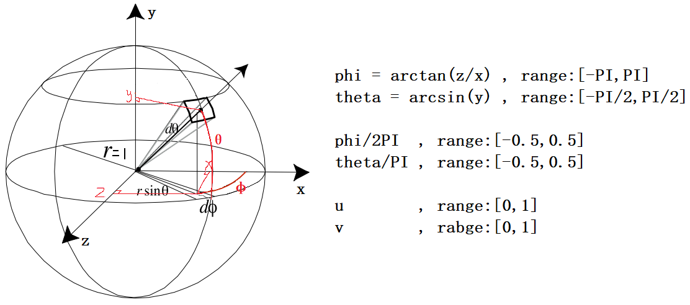
代码如下:  
``` cpp
const vec2 invAtan = vec2(0.1591, 0.3183);
// hdr文件存储每个浮点值的方式
// 每个通道存储 8 位，再以 alpha 通道存放指数
// 因此利用这种方式解码
vec3 hdrDecode(vec4 encoded){
    float exponent = encoded.a * 256.0 - 128.0;
    vec3 mantissa = encoded.rgb;
    return exp2(exponent) * mantissa;
}
vec2 SampleSphericalMap(vec3 v)
{
    vec2 uv = vec2(atan(v.z, v.x), asin(v.y));
    uv *= invAtan;
    uv += 0.5;
    return uv;
}
void main()
{		
    vec2 uv = SampleSphericalMap(normalize(WorldPos));
    vec4 enCodeColor = texture(uEquirectangularMap,uv).rgba;
    vec3 deCodeColor = hdrDecode(enCodeColor);
    fragColor = vec4(vec3(deCodeColor), 1.0);
}
```  

## 环境光Cook-Torrance反射方程的预计算  

快速浏览一下反射方程：  
$$
L_{o}(p,w_{o})=\int_{\Omega}^{}(kd\frac{c}{\pi}+ks\frac{DFG}{4(w_{o}\cdot n)(w_{i}\cdot n)})L_{i}(p,w_{i})n\cdot w_{i}dw_{i} \tag{2}
$$
该公式的解释可以参考[Opengl Pbr](https://learnopengl-cn.github.io/07%20PBR/01%20Theory/)。值得一提的是公式中`ks`和`Fresnel`项指代的同一件事情，所以`ks`可以省略，其中`o`代表出射方向也就是我们看到的方向，`i`是入射方向即光照方向。

### 漫反射光照的预计算  

仔细观察会发现`BRDF`的漫反射`kd`和镜面`ks`项是相互独立的，我们可以将积分分成两部分： 
$$
L_{o}(p,w_{o})=\int_{\Omega}(kd\frac{c}{\pi})L_{i}(p,w_{i})n\cdot w_{i}dw_{i}+\int_{\Omega}(\frac{DFG}{4(w_{o}\cdot n)(w_{i}\cdot n)})L_{i}(p,w_{i})n\cdot w_{i}dw_{i} \tag{3}
$$
前这部分才是本节的重点，让我们在化简一下(颜色`c`,漫反射率`kd`,和`π`在整个积分是常数)：  
$$
L_{o}(p,w_{o})=(kd\frac{c}{\pi})\int_{\Omega}L_{i}(p,w_{i})n\cdot w_{i}dw_{i} \tag{4}
$$
经过简化有可以发现，积分目前只跟`wi`有关(假设物体上的点p位于立方体中间，`N`为`p`与立方体上某点的连线)，由于是漫反射在半球上的积分，其入射方向是均匀的来自半球的四面八方。  
积分参考`Opengl`的方法：对于立方体贴图的每个纹素，在`纹素所代表的方向`的半球Ω内生成固定数量的采样向量，并对采样结果取平均值。数量固定的采样向量将均匀地分布在半球内部。注意，积分是连续函数，在采样向量数量固定的情况下离散地采样只是一种近似计算方法，我们采样的向量越多，就越接近正确的结果。   
纹素所代表的方向的半球`Ω`内生成固定数量的采样向量，图解如下：  
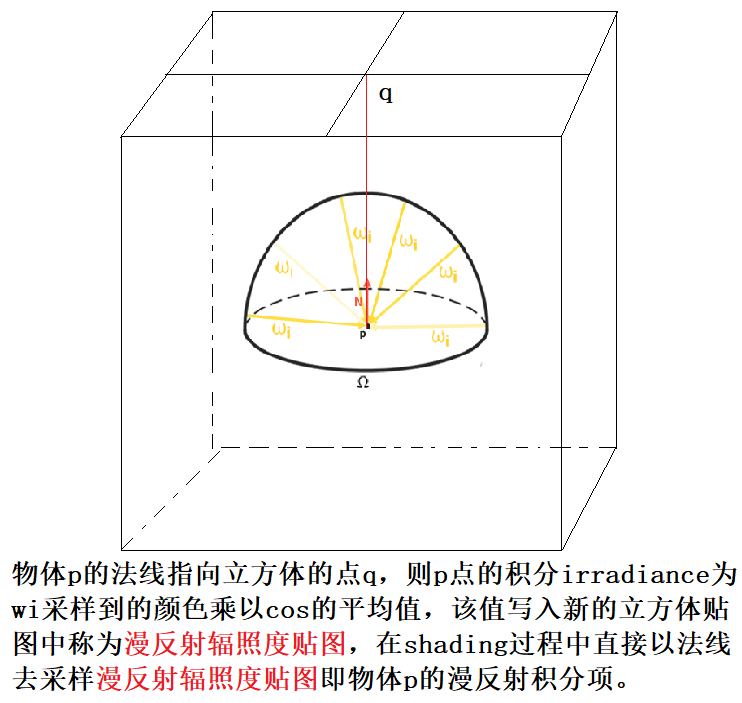  
反射方程的积分`∫`是围绕立体角`dw`旋转，而这个立体角相当难以处理。为了避免对难处理的立体角求积分，我们使用球坐标`θ`和`ϕ`来代替立体角。公式如下：  
$$
L_{o}(p,\phi_{o},\theta_{o})=kd\frac{c}{\pi}\int_{\phi=0}^{2\pi}\int_{\theta=0}^{\frac{1}{2}\pi}L_{i}(p,\phi_{i},\theta_{i})\cos(\theta_{i})\sin(\theta_{i})d\theta d\phi\\
=kd\frac{c}{\pi}\frac{2\pi}{n1}\frac{\pi}{2\cdot n2}\sum_{m=0}^{n1}\sum_{n=0}^{n2}L_{i}(p,\phi_{m},\theta_{n})\cos(\theta_{n})\sin(\theta_{n})\\
=kd\frac{c\pi}{n1\cdot n2}\sum_{m=0}^{n1}\sum_{n=0}^{n2}L_{i}(p,\phi_{m},\theta_{n})\cos(\theta_{n})\sin(\theta_{n}) \tag{5}
$$
该结果由蒙特卡洛积分所得，`φ`的概率密度为`1/2PI`，`θ`的概率密度为`2/PI`，其中添加的`sin(θ)`是为了权衡较高半球区域的较小采样区域的贡献度如图：  
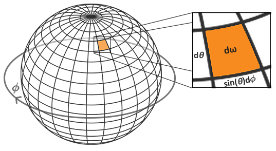  
给定每个片段的积分球坐标，对半球进行离散采样，过程代码如下：  
``` cpp
const float PI = 3.14159265359;
void main()
{		
    vec3 N = normalize(WorldPos);
    vec3 irradiance = vec3(0.0);   
    // tangent space calculation from origin point
    vec3 up    = vec3(0.0, 1.0, 0.0);
    vec3 right = normalize(cross(up, N));
    up         = normalize(cross(N, right));
    float sampleDelta = 0.025;
    float nrSamples = 0.0f;
    for(float phi = 0.0; phi < 2.0 * PI; phi += sampleDelta)
    {
        for(float theta = 0.0; theta < 0.5 * PI; theta += sampleDelta)
        {
            // spherical to cartesian (in tangent space)
            vec3 tangentSample = vec3(sin(theta) * cos(phi),  sin(theta) * sin(phi), cos(theta));
            // tangent space to world
            vec3 sampleVec = tangentSample.x * right + tangentSample.y * up + tangentSample.z * N; 
            irradiance += texture(uEnvironmentMap, sampleVec).rgb * cos(theta) * sin(theta);
            nrSamples++;
        }
    }
    irradiance = PI * irradiance * (1.0 / float(nrSamples));
    FragColor = vec4(irradiance, 1.0);
}
```
球坐标系转笛卡尔坐标系，得到的是切线空间的向量，需要用`TBN`矩阵将该向量转至世界空间。最后得到漫反射辐照度贴图如下：  
  
糊的很，根本没有细节可言。

### SplitSum和GGX重要性采样  

为了理解，我们回顾一下反射方程，但这次只关注镜面反射部分（在上一节中已经剥离了漫反射部分）：  
$$
L_{o}(p,w_{o})=\int_{\Omega}(\frac{DFG}{4(w_{o}\cdot n)(w_{i}\cdot n)})L_{i}(p,w_{i})n\cdot w_{i}dw_{i} \tag{6}
$$
对这部分积分进行预计算有个棘手的地方，它不仅依赖`wi`还依赖`wo`，我们不可能吧`wi`和`wo`的每种组合都进行预计算(wi(θ，φ),wo(θ，φ),F0,roughness,一共六个维度也无法预计算)，所以`Epic Games`提出了一个新的解决方法[split sum](http://blog.selfshadow.com/publications/s2013-shading-course/karis/s2013_pbs_epic_notes_v2.pdf)：  
$$
\int_{\Omega}(\frac{DFG}{4(w_{o}\cdot n)(w_{i}\cdot n)})L_{i}(p,w_{i})n\cdot w_{i}dw_{i} \\
\approx\frac{1}{N}\sum_{k=1}^{N}\frac{L_{i}(p,w_{ik})f_{r}(p,w_{ik},w_{ok})\cos(\theta_{ik})}{p(w_{ik},w_{ok})} \\
\approx(\frac{1}{N}\sum_{k=1}^{N}L_{i}(p,w_{ik}))(\frac{1}{N}\sum_{k=1}^{N}\frac{f_{r}(p,w_{ik},w_{ok})\cos(\theta_{ik})}{p(w_{ik},w_{ok})}) \tag{7}
$$
该式子左边是一个求和，右边是蒙特卡洛积分，左右分别为两维度，可以直接查表。左边wi是两维度好理解，右边两维度我在后面章节解释。我们分别对这两部分进行预计算就可以解决上面棘手的部分。  
但是它们都是建立在`GGX重要性采样`的基础上，先介绍一下重要性采样：  
我们使用球面坐标生成均匀分布在半球`Ω`上的采样向量，以对环境贴图进行卷积。虽然这个方法非常适用于辐照度，但对于镜面反射效果较差。镜面反射依赖于表面的粗糙度，反射光线可能比较松散，也可能比较紧密，但是一定会围绕着反射向量`r`，除非表面极度粗糙:  
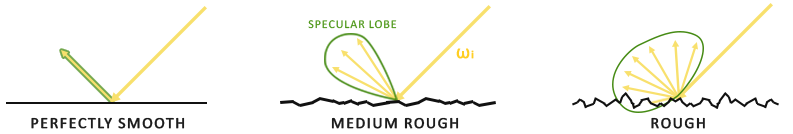  
所有可能出射的反射光构成的形状称为镜面波瓣。随着粗糙度的增加，镜面波瓣的大小增加；随着入射光方向不同，形状会发生变化。因此，镜面波瓣的形状高度依赖于材质。 在微表面模型里给定入射光方向，则镜面波瓣指向微平面的半向量的反射方向。考虑到大多数光线最终会反射到一个基于半向量的镜面波瓣内，采样时以类似的方式选取采样向量是有意义的，因为大部分其余的向量都被浪费掉了。根据表面粗糙度生成法线`N`，然后以镜面反射的形式计算出采样方向的过程称为`重要性采样`。  
要理解重要性采样需要先理解[逆变换采样](https://en.wikipedia.org/wiki/Inverse_transform_sampling)，逆变换采样是用range为[0,1]之间的均匀随机数来生成服从pdf的样本，其过程如下：  
1.从均匀分布`U[0,1]`中产生一个随机数`ui`  
2.计算$x_{i}=F_{X}^{-1}(u_{i})$作为采样结果  
其中$F_{X}(x)$为`CDF`(累积分布函数)所有的`CDF`中，在`x`趋近最小值时，`CDF`趋近于`0`，当`x`趋近最大值时，`CDF`趋近与`1`。   
$f_{X}(x)$为随机变量`X`的`pdf`(概率密度函数)。这是它们的关系$F_{X}(x)=\int_{-\infty}^{x}f_{X}(u)du$  
$F_{X}^{-1}(x)$为`cdf`的反函数，只有单调非减的函数才有反函数。
`GGX重要性采样`用的概率密度函数为[D(h)dot(n,h)](https://www.reedbeta.com/blog/hows-the-ndf-really-defined/)，其在球坐标系下的概率密度函数为： 
$$
p_{h}(\theta,\phi)=\frac{\alpha^{2}\cos(\theta)\sin(\theta)}{\pi((\alpha^{2}-1)\cos^{2}(\theta)+1)^{2}} \tag{8}
$$
分别求θ和φ的边缘概率密度函数(pdf)：
$$
p_{h}(\theta)=\int_{0}^{2\pi}p_{h}(\theta,\phi)d\phi=\frac{2\alpha^{2}\cos(\theta)\sin(\theta)}{((\alpha^{2}-1)\cos^{2}(\theta)+1)^{2}} \tag{9}
$$
$$
p_{h}(\phi)=\int_{0}^{\frac{\pi}{2}}\frac{\alpha^{2}\cos(\theta)\sin(\theta)}{\pi((\alpha^2-1)\cos^{2}(\theta)+1)^{2}}d\theta \\
=-\frac{\alpha^{2}}{2\pi}\int_{0}^{\frac{\pi}{2}}\frac{-2\cos(\theta)\sin(\theta)}{((\alpha^2-1)\cos^{2}(\theta)+1)^{2}}d\theta \\
=\frac{\alpha^{2}}{2\pi}\int_{\frac{\pi}{2}}^{0}\frac{1}{((\alpha^2-1)\cos^{2}(\theta)+1)^{2}}d(\cos^{2}\theta) \\
=\frac{\alpha^{2}}{2\pi}\int_{0}^{1}\frac{1}{((\alpha^{2}-1)t+1)^{2}}dt \\
$$
令`x=(α^2-1)t+1`
$$
=\frac{\alpha^{2}}{2\pi(\alpha^2-1)}\int_{1}^{\alpha^2}\frac{1}{x^{2}}dx \\
=\frac{\alpha^{2}}{2\pi(1-\alpha^2)}\frac{1}{x}\vert_{1}^{\alpha^2} \\
=\frac{1}{2\pi} \tag{10}
$$
再分别求`θ`和`φ`的累计分布函数(cdf):
$$
P_{h}(\phi)=\int_{0}^{\phi}\frac{1}{2\pi}dt=\frac{\phi}{2\pi} \tag{11}
$$
$$
P_{h}(\theta)=\int_{0}^{\theta}\frac{2\alpha^{2}\cos(t)\sin(t)}{((\alpha^{2}-1)\cos^{2}(t)+1)^{2}}dt \\
=\alpha^{2}\int_{\theta}^{0}\frac{1}{(\alpha^2-1)\cos^{2}(t)+1)^{2}}d(\cos^{2}(t)) \\
=\frac{\alpha^2}{\alpha^2-1}\int_{\alpha^2}^{(\alpha^2-1)\cos^{2}(\theta)+1}-\frac{1}{x^{2}}dx \\
=\frac{\alpha^2}{\alpha^2-1}\frac{1}{x}\vert_{\alpha^{2}}^{(\alpha^2-1)\cos^{2}(\theta)+1} \\
=\frac{\alpha^{2}}{\alpha^{2}-1}\cdot (\frac{1}{(\alpha^2-1)\cos^{2}(\theta)+1}-\frac{1}{\alpha^{2}}) \tag{12}
$$
反函数就是函数值域`Y`和定义域`X`的映射关系翻转一下。
均匀的从`U[0,1]`中取出两个随机数$X_{1}$和$X_{2}$,则我们要的采样`θ`和`φ`为：  
$$
\phi=2\pi X_{1} \tag{13}
$$
$$
\theta=\arccos\sqrt{\frac{1-X_{2}}{X_{2}(\alpha^{2}-1)+1}} \tag{14}
$$
对应代码实现如下：  
``` cpp
vec3 ImportanceSampleGGX(vec2 Xi, vec3 N, float roughness)
{
	float a = roughness*roughness;	
	float phi = 2.0 * PI * Xi.x;
	float cosTheta = sqrt((1.0 - Xi.y) / (1.0 + (a*a - 1.0) * Xi.y));
	float sinTheta = sqrt(1.0 - cosTheta*cosTheta);
	// from spherical coordinates to cartesian coordinates - halfway vector
	vec3 H;
	H.x = cos(phi) * sinTheta;
	H.y = sin(phi) * sinTheta;
	H.z = cosTheta;
	// from tangent-space H vector to world-space sample vector
	vec3 up          = abs(N.z) < 0.999 ? vec3(0.0, 0.0, 1.0) : vec3(1.0, 0.0, 0.0);
	vec3 tangent   = normalize(cross(up, N));
	vec3 bitangent = cross(N, tangent);
	vec3 sampleVec = tangent * H.x + bitangent * H.y + N * H.z;
	return normalize(sampleVec);
}
```
### 镜面反射光照的预计算  

上节内容提到用`Split Sum`来分割镜面反射的光照和BRDF部分以避免去求wi和wo所有组合下的积分。本节重要点放在镜面反射光照的预计算，我们再看下这部分的公式：  
$$
\frac{1}{N}\sum_{k=1}^{N}L_{i}(p,w_{ik}) \tag{15}
$$
这里可以看做是一次求和取平均。还有一个问题就是，这里的wi不仅需要`GGX重要性采样`得到的符合`D(h)dot(n,h)概率密度函数`的微表面法线方向，还需要视角方向`V`,但是我们并不能提前知道`V`是什么方向，这里`Epic Games`再一次假设，即`v=r=n`。这种各向同性假设是第二个近似来源，不幸的是，这意味在掠入射角时不会得到长反射效果：  
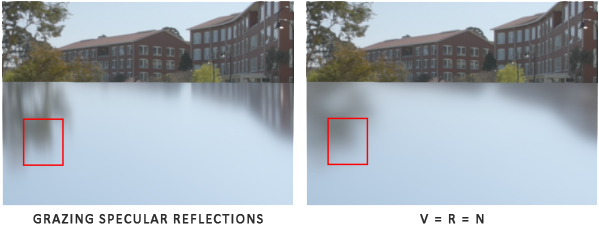  
与分裂和近似相比，这实际上是我们`IBL`解的较大误差源。代码中通过`cosθlk`加权可以获得更好的结果：  
```cpp
void main()
{		
    vec3 N = normalize(WorldPos);
    // make the simplifying assumption that V equals R equals the normal 
    vec3 R = N;
    vec3 V = R;
    const uint SAMPLE_COUNT = 1024u;
    vec3 prefilteredColor = vec3(0.0);
    float totalWeight = 0.0;
    for(uint i = 0u; i < SAMPLE_COUNT; ++i)
    {
        // generates a sample vector that's biased towards the preferred alignment direction (importance sampling).
        vec2 Xi = Hammersley(i, SAMPLE_COUNT);
        vec3 H = ImportanceSampleGGX(Xi, N, uRoughness);
        vec3 L  = normalize(2.0 * dot(V, H) * H - V);
        //COS weight can increase image quality
        float NdotL = max(dot(N, L), 0.0);
        if(NdotL > 0.0)
        {
            // sample from the environment's mip level based on roughness/pdf
            float D   = DistributionGGX(N, H, uRoughness);
            float NdotH = max(dot(N, H), 0.0);
            float HdotV = max(dot(H, V), 0.0);
            float pdf = D * NdotH / (4.0 * HdotV) + 0.0001; 
            float resolution = 512.0; // resolution of source cubemap (per face)
            float saTexel  = 4.0 * PI / (6.0 * resolution * resolution);
            float saSample = 1.0 / (float(SAMPLE_COUNT) * pdf + 0.0001);
            //sample solid angle ratio to pixel solid angle
            float mipLevel = uRoughness == 0.0 ? 0.0 : 0.5 * log2(saSample / saTexel);        
            prefilteredColor += textureLod(uEnvironmentMap, L, mipLevel).rgb * NdotL;
            totalWeight      += NdotL;
        }
    }
    prefilteredColor = prefilteredColor / totalWeight;
    FragColor = vec4(prefilteredColor, 1.0);
}
```
代码中的`pdf`推导过程如下，图片来源于[2007年论文](https://www.cs.cornell.edu/~srm/publications/EGSR07-btdf.pdf)：  
$$
p_{o}(\theta,\phi)=p_{h}(\theta,\phi)\cdot\lVert\frac{\partial w_{h}}{\partial w_{o}}\rVert \tag{16}
$$
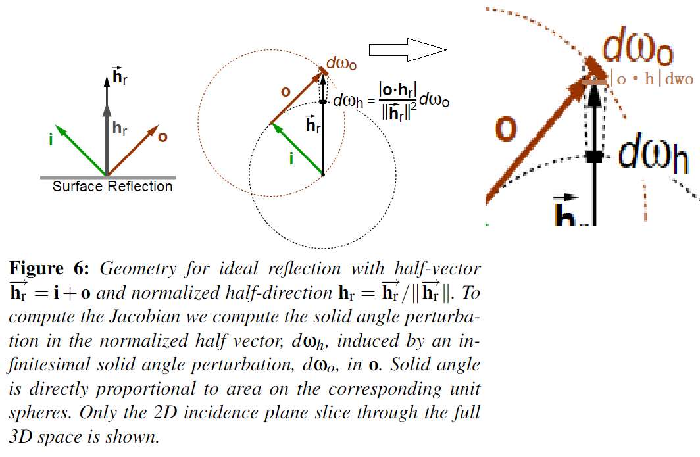  
$$
\lVert\frac{\partial w_{h}}{\partial w_{o}}\rVert=\frac{\vert o\cdot h\vert}{\lVert\vec{h}\rVert^{2}} \\
=\frac{\vert o\cdot h\vert}{\lVert 2(o\cdot h)h\rVert^{2}}
=\frac{\vert o\cdot h\vert}{4(o\cdot h)^{2}\lVert h\rVert^{2}}=\frac{1}{4\vert o\cdot h\vert} \tag{17}
$$
其中`i`，`o`和`没箭头的h`，都是归一化后的向量。这只是反射模型的`pdf`，以同样的计算方法论文作者还给出了折射的`pdf`，感兴趣可以去看下。需要注意的是这里推导涉及的i，o和代码中的v，L没关系，只是单纯用来推导的,一般来说我们视`i`为光照方向，`o`为视角方向。

代码中[采样](https://developer.nvidia.com/gpugems/gpugems3/part-iii-rendering/chapter-20-gpu-based-importance-sampling)是对`uEnvironmentMap`的`mipmap`来采样，而不是直接去获取清晰度最高的`uEnvironmentMap`,这样做的原因是`pdf`越低，样本所对应的环境贴图中平均像素数就越多，使用的`mipmap`层级应该越大，这可以做到少采样数量达到多采样数量的效果，并减少伪影。我们用与样本相关的实体角来定义这种关系，计算方法是`pdf`与样本总数`N`之间乘积的倒数：  
$$
\Omega_{s}=\frac{1}{N\cdot p_{L}(\theta,\phi)} \tag{18}
$$
该式子表示采样方向所对应的环境贴图中像素数的多少(采样立体角的大小)。我们还需要知道立方体贴图中一个像素对应的立体角是多大,我们这里是求单位球表面积比上立方体分辨率：  
$$
\Omega_{p}=\frac{d(u)}{w\cdot h} \tag{19}
$$
原文这个`d(u)`是计算从半球的单位面积到纹理上的单位面积的变化速率（换句话说，计算映射的畸变率），原文`d(u)`是应用在另一种采样方式，不是在立方体贴图上面进行的采样，和我们这里不一样，我们这里直接算立方体贴图上一个像素对应的立体角大小就行。那`d(u)`直接就是单位球的表面积`4π`。  
最后用下面这个公式计算`mipmap`层数：  
$$
level=max[\frac{1}{2}\log_{2}\frac{\Omega_{s}}{\Omega_{p}},0] \tag{20}
$$
最后计算完的`prefilteredColor`根据粗糙度`[0,1]`，分别存入`prefilterMap`的`5`层`mipmap`中，在最后`shading`过程中，根据粗糙度来获取`prefilteredColor`层数。代码如下：  
```js
gl.bindFramebuffer(gl.FRAMEBUFFER, captureFBO);
const maxMipLevels = 5;
for (let mip = 0; mip < maxMipLevels; ++mip)
{
    // reisze framebuffer according to mip-level size.
    let mipWidth  = 128 * Math.pow(0.5, mip);
    let mipHeight = 128 * Math.pow(0.5, mip);
    gl.bindRenderbuffer(gl.RENDERBUFFER, captureRBO);
    gl.renderbufferStorage(gl.RENDERBUFFER, gl.DEPTH_COMPONENT24, mipWidth, mipHeight);
    gl.viewport(0, 0, mipWidth, mipHeight);
    let roughness = mip / (maxMipLevels - 1);
    gl.uniform1f(this.prefilterShader.program.uniforms["uRoughness"],roughness);
    for (let i = 0; i < 6; ++i)
    {
        gl.uniformMatrix4fv(
            this.prefilterShader.program.uniforms["uViewMatrix"],
            false,
            this.captureViews[i]);
        gl.framebufferTexture2D(gl.FRAMEBUFFER, gl.COLOR_ATTACHMENT0, gl.TEXTURE_CUBE_MAP_POSITIVE_X + i, this.prefilterMap, mip);
        gl.clear(gl.COLOR_BUFFER_BIT | gl.DEPTH_BUFFER_BIT);
        this.renderCube();
    }
}
gl.bindFramebuffer(gl.FRAMEBUFFER, null);
```
一切顺利的话，会得到下面的图片：  


### 预计算BRDF  

有了上面的基础，这部分内容就比较简单了，快速看一遍公式：  
$$
\frac{1}{N}\sum_{k=1}^{N}\frac{f_{r}(p,w_{ik},w_{ok})\cos(\theta_{ik})}{p(w_{ik},w_{ok})} \tag{21}
$$
上文说到镜面反射方程有六个维度`wi(θ，φ)`,`wo(θ，φ)`,`F0`,`roughness`,由于光照部分我们已经处理过了，而此时`BRDF`的`wi`和`wo`都是和`n`绑定在一起的，那这里`BRDF`就只剩下`4`个维度`wi·n`,`wo·n`,`F0`,`roughness`,由于重要性采样可以由`wo`生成服从`D(h)dot(n,h)`概率密度函数的`wi`，则维度可以再降到3个`wo·n`,`F0`,`roughness`，再将`Fresnel`项拆分成两部分，`F0`也可以移出积分范围，维度再降到2个`wo·n`,`roughness`，这样就可以愉快的打表了😆！下面是拆分过程，我这里把`k`角标去掉了方便观看：  
$$
\frac{1}{N}\sum_{k=1}^{N}\frac{f_{r}(p,w_{i},w_{o})\cos(\theta_{i})}{p(w_{i},w_{o})} \\
=\frac{1}{N}\sum_{k=1}^{N}\frac{f_{r}(p,w_{i},w_{o})F(w_{o},h)\cos(\theta_{i})}{F(w_{o},h)p(w_{i},w_{o})} \\
=\frac{1}{N}\sum_{k=1}^{N}\frac{f_{r}(p,w_{i},w_{o})}{F(w_{o},h)p(w_{i},w_{o})}(F0+(1-F0)(1-w_{o}\cdot h)^{5})\cos(\theta_{i})
$$
这里用`α`代替`(1-wo·h)^5`:  
$$
=\frac{1}{N}\sum_{k=1}^{N}\frac{f_{r}(p,w_{i},w_{o})}{F(w_{o},h)p(w_{i},w_{o})}(F0+(1-F0)\alpha)\cos(\theta_{i}) \\
=\frac{1}{N}\sum_{k=1}^{N}\frac{f_{r}(p,w_{i},w_{o})}{F(w_{o},h)p(w_{i},w_{o})}(F0*(1-\alpha)+\alpha)\cos(\theta_{i}) \\
=\frac{1}{N}\sum_{k=1}^{N}\frac{f_{r}(p,w_{i},w_{o})}{F(w_{o},h)p(w_{i},w_{o})}F0*(1-\alpha)\cos(\theta_{i})+\frac{1}{N}\sum_{k=1}^{N}\frac{f_{r}(p,w_{i},w_{o})}{F(w_{o},h)p(w_{i},w_{o})}\alpha\cos(\theta_{i}) \tag{22}
$$
可以看到这两部分都包含一个共同项：  
$$
\frac{f_{r}(p,w_{i},w_{o})}{F(w_{o},h)p(w_{i},w_{o})}\cos(\theta_{i})
$$
我们将其化简一下,其中`pdf=D * NdotH / (4.0 * VdotH)`：  
$$
=\frac{DG\cos(\theta_{i})}{4\cos(\theta_{o})\cos(\theta_{i})}\frac{4(o\cdot h)}{D(n\cdot h)} \\
=\frac{G(o\cdot h)}{(o\cdot n)(n\cdot h)} \tag{23}
$$
带入(22)式中得：  
$$
F0*\frac{1}{N}\sum_{k=1}^{N}\frac{G(o\cdot h)}{(o\cdot n)(n\cdot h)}(1-(1-(w_{o}\cdot h)^{5}))+\frac{1}{N}\sum_{k=1}^{N}\frac{G(o\cdot h)}{(o\cdot n)(n\cdot h)}(1-(w_{o}\cdot h)^{5}) \tag{24}
$$
代码实现如下：  
```cpp
vec2 IntegrateBRDF(float NdotV, float roughness)
{
    vec3 V;
    V.x = sqrt(1.0 - NdotV*NdotV);
    V.y = 0.0;
    V.z = NdotV;
    float A = 0.0;
    float B = 0.0; 
    vec3 N = vec3(0.0, 0.0, 1.0);
    const uint SAMPLE_COUNT = 1024u;
    for(uint i = 0u; i < SAMPLE_COUNT; ++i)
    {
        // generates a sample vector that's biased towards the
        // preferred alignment direction (importance sampling).
        vec2 Xi = Hammersley(i, SAMPLE_COUNT);
        vec3 H = ImportanceSampleGGX(Xi, N, roughness);
        vec3 L = normalize(2.0 * dot(V, H) * H - V);
        float NdotL = max(L.z, 0.0);
        float NdotH = max(H.z, 0.0);
        float VdotH = max(dot(V, H), 0.0);
        if(NdotL > 0.0)
        {
            float G = GeometrySmith(N, V, L, roughness);
            float G_Vis = (G * VdotH) / (NdotH * NdotV);
            float Fc = pow(1.0 - VdotH, 5.0);
            //pdf = D * NdotH / (4.0 * HdotV); 
            A += (1.0 - Fc) * G_Vis;
            B += Fc * G_Vis;
        }
    }
    A /= float(SAMPLE_COUNT);
    B /= float(SAMPLE_COUNT);
    return vec2(A, B);
}
```
如果一切顺利，会得到这样一张纹理：  
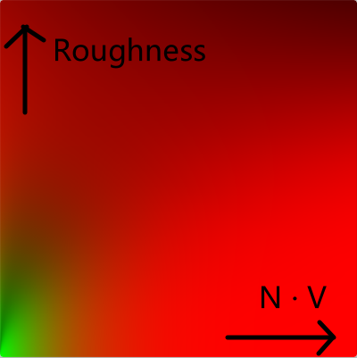  
代码中debug出的样子如下：  
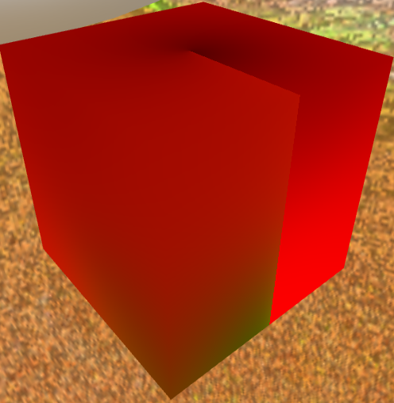

## 完成IBL反射  

对上面完成的三部分预计算纹理进行查表，即环境光Cook-Torrance反射方程的积分值。代码如下：  
```cpp
vec3 fresnelSchlickRoughness(vec3 F0, vec3 V, vec3 N,float roughness){
    return F0 + (max(vec3(1.0 - roughness), F0) - F0) * pow(1.0 - max(dot(N,V),0.0), 5.0);
} 
...
//以环境光作为IBL
vec3 F = fresnelSchlickRoughness(F0,V,N,uRoughness);
vec3 kD = (vec3(1.0) - F) * (1.0 - uMetallic);
//漫反射光照项
vec3 irradiance = texture(uIrradianceMap,N).rgb;
vec3 diffuse = irradiance * albedo;
//以确保不会对一个没有数据的mip级别采样
const float MAX_REFLECTION_LOD = 4.0;
//镜面反射光照项
vec3 prefilteredColor = textureLod(uPrefilterMap,R,uRoughness * MAX_REFLECTION_LOD).rgb;
//BRDF项
vec2 brdf = texture(uPbrBrdfLUT,vec2(max(dot(N,V),0.0),uRoughness)).rg;
//split sum
vec3 specular = prefilteredColor * (F0 * brdf.r + brdf.g);
//环境光Cook-Torrance反射方程的积分值
vec3 ambient = (kD * diffuse + specular) * uAo;
```
使用`fresnelSchlickRoughness`函数，是由于环境光来自在半球内所有围绕着法线`N`的方向，没有单一的半向量去决定菲涅尔因子。为了仍然能模拟菲涅尔，这里采用了法线和视线的夹角。之前的算法采用了受表面粗糙度影响的微平面半向量，作为菲涅尔方程的输入。这里我们加入粗糙度来权衡这一损失。  
然后将`ambient`加到正常的`PBR`模型上就大功告成了：  
```cpp
vec3 albedo = pow(texture(uAlbedoMap, vTexCoords).rgb,vec3(2.2));

vec3 N = normalize(vNormal);
vec3 V = normalize(uCameraPos - vWorldPos);
vec3 R = reflect(-V, N);

vec3 F0 = vec3(0.04); 
F0 = mix(F0, albedo, uMetallic);
vec3 Lo = vec3(0.0);
for (uint i = 0u;i < 4u;++i){
    vec3 L = normalize(uLightPos[i] - vWorldPos);
    vec3 H = normalize(V + L);
    // float distance = length(uLightPos[i] - vWorldPos);
    // float attenuation = 1.0 / (distance * distance); 
    vec3 radiance = uLightColors[i] * 1.0;
    //Cook-Torrance BRDF
    float NDF = DistributionGGX(N, H, uRoughness);   
    float G   = GeometrySmith(N, V, L, uRoughness); 
    vec3 F    = fresnelSchlick(F0, V, H);
    float NdotL = max(dot(N,L),0.0);
    float NdotV = max(dot(N,V),0.0);
    vec3 numerator    = NDF * G * F; 
    float denominator = max((4.0 * NdotL * NdotV), 0.0000001);
    vec3 specular = numerator / denominator;
    //Reference opengl pbr
    vec3 diffuse = (vec3(1.0)-F) * (1.0 - uMetallic) * albedo / PI;
    // Lo += ( diffuse + specular) * radiance * NdotL;
    Lo += (specular) * radiance * NdotL;
}
...
vec3 color = ambient + Lo;
// HDR tonemapping
color = color / (color + vec3(1.0));
// gamma correct
color = pow(color, vec3(1.0/2.2)); 
FragColor = vec4(color, 1.0);
```
为了对比`kulla Conty`方法这里吧`diffuse`项去掉。
一切顺利的话，会得到下面的效果：  
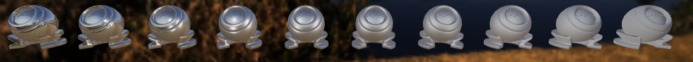  

# Kulla Conty Approximation

## 预计算E(μ)和E_avg
在引入`Kulla Conty`方法之前，我们看下`Cook-Torrance`反射方程的`G`项：  
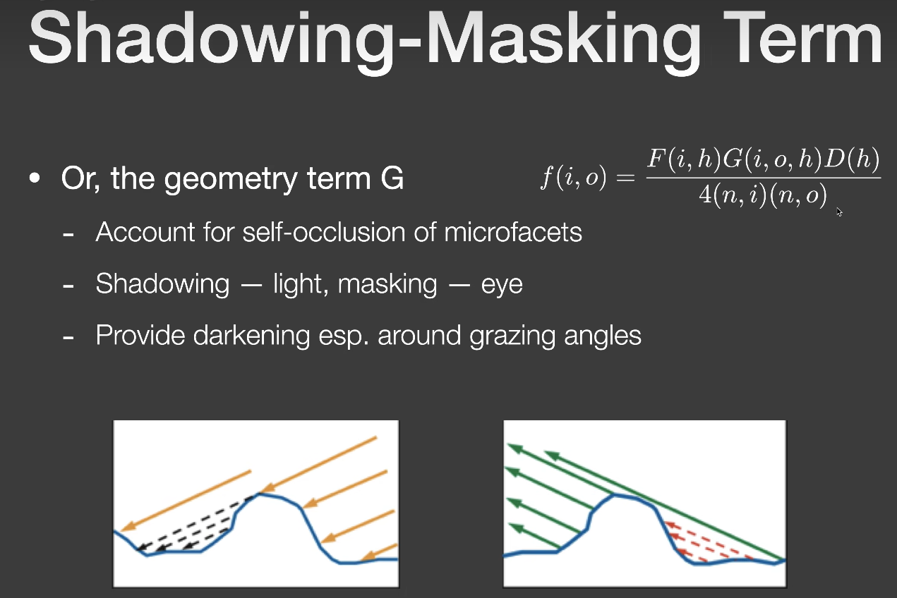  
`G`项考虑了微表面模型的自遮挡现象，在垂直角度看微表面时，几乎没有自遮挡现象，而在掠射角方向看向微表面时，自遮挡现象就会很严重，这是符合物理现象的。但是`G`项只考虑了光线在微表面上一次反射后的结果，这就导致必定会有一部分参与后续弹射的光线未被考虑进去，当粗糙度越高，沟壑越大后续弹射的光线占比越大能量损失就越多。而`kulla conty`方法就是为了弥补这部分损失的能量。  

考虑`Kulla Conty`方法时，首先我们需要知道有多少能量丢失了，如果只考虑一次反射，那丢失的能量就是`1 - 一次反射`。而微表面反射模型本来也就是只考虑了一次的反射，我们假设所有入射方向`Li`的`radiance`都为`1`，则一次反射后我们能看到的能量为： 
$$
E(p,w_o)=\int_{\Omega+}\frac{DG}{4(w_o\cdot n)(w_i\cdot n)}n\cdot w_idw_i \tag{25}
$$
由于这里考虑的全反射，`F`自然就`1`，然后我们设`μi=cos(wi)`:  
$$
E(\mu_o)=\int_{0}^{2\pi}\int_{0}^{1}f(\mu_o,\mu_i,\phi)\mu_id\mu_id\phi \tag{26}
$$
这里`θ`由`π/2`到`0`。闫老师课上讲的是用`sinθ`去替换，但是后面计算`sinθ`说不通，而不论`sinθ`替换还是`conθ`，其推导出的公式都是一样，不同的是`sinθ`，`θ`由`0`到`π/2`。  

得到了`E(μo)`后，那我们就可以设计另一个`BRDF`使得其积分的结果为`1-E(μo)`，然后将结果加到原有的`BRDF`上面，这样就不会有能量损失了。  
这个新设计的`BRDF`就是：  
$$
f_{ms}(\mu_o,\mu_i)=\frac{(1-E(\mu_o))(1-E(\mu_i))}{\pi(1-E_{avg})} \tag{27}
$$
其中`E_avg`是函数`E(μ)`在区间`[0,1]`的平均值：  
$$
E_{avg}=\frac{\int_{0}^{1}E(\mu)\mu d\mu}{\int_{0}^{1}\mu d\mu} \\
=2\int_{0}^{1}E(\mu)\mu d\mu \tag{28}
$$
其正确性参考课堂上给的过程： 
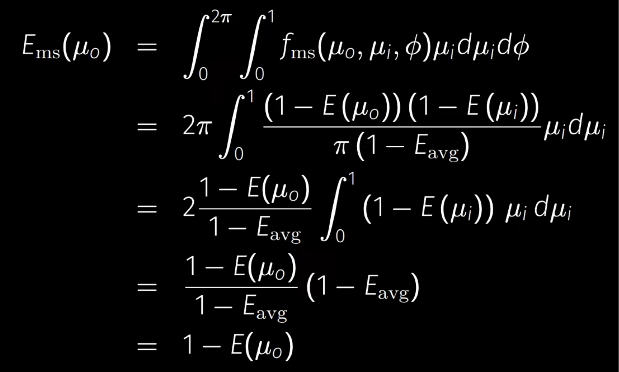  
该新设计的`BRDF`中有两个积分值，我们同样采用打表的形式，把积分值存到一张纹理中。`E(μ)`的积分值我们同样使用重要性采样来保证结果的正确性，其代码实现如下：  
```cpp
Vec3f IntegrateBRDF(Vec3f V, float roughness) {
    const int sample_count = 1024;
    float A = 0.0;
    float B = 0.0;
    Vec3f N = Vec3f(0.0, 0.0, 1.0);
    for (int i = 0; i < sample_count; i++) {
        Vec2f Xi = Hammersley(i, sample_count);
        Vec3f H = ImportanceSampleGGX(Xi, N, roughness);
        Vec3f L = normalize(H * 2.0f * dot(V, H) - V);
        float NoL = std::max(L.z, 0.0f);
        float NoH = std::max(H.z, 0.0f);
        float VoH = std::max(dot(V, H), 0.0f);
        float NoV = std::max(dot(N, V), 0.0f);
        // TODO: To calculate (fr * ni) / p_o here - Bonus 1
        float Fc = pow(1.0f - VoH, 5.0f);
        float G = GeometrySmith(roughness, NoV, NoL);
        float G_Vis  = VoH * G / (NoV * NoH);

        // //no split sum 
        // A += G_Vis;

        // Split Sum - Bonus 2
        A += (1.0 - Fc) * G_Vis;
        B += Fc * G_Vis;
    }
    // return { A / sample_count, A / sample_count, A / sample_count }; // No split sum version
    return { A / sample_count, B / sample_count, 0.0 };  // Split sum
}
```
其实这里严谨来说不叫`Split Sum`，该方法是对光照的剥离，我在上面章节有提到。但是作业要求有`Split Sum`的提高部分，我猜测应该是想让我们这样实现吧。但是仔细考虑的话其实也没必要这么实现，因为计算一次反射的能量，其`Fresenl`项为`1`即全反射，这里也不需要将`F0`剥离来使参数降维。就这样吧，这样得到的纹理如下：  
Split Sum  
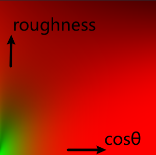  
Not Split Sum  
  

`E_avg`的预计算就比较简单了，代码如下：  
```cpp
Vec3f IntegrateEmu(Vec3f V, float roughness, float NdotV, Vec3f Ei) {
    Vec3f Eavg = Vec3f(0.0f);
    const int sample_count = 1024;
    Vec3f N = Vec3f(0.0, 0.0, 1.0);
    for (int i = 0; i < sample_count; i++) {
        Vec2f Xi = Hammersley(i, sample_count);
        Vec3f H = ImportanceSampleGGX(Xi, N, roughness);
        Vec3f L = normalize(H * 2.0f * dot(V, H) - V);
        float NoL = std::max(L.z, 0.0f);
        // float pdf = 1;//跟roughness没关系
        // TODO: To calculate Eavg here
        Eavg +=  Ei * 2.0f * NoL ;//Ei * 2.0f * NoL, NoL : cos thetai
    }
    return Eavg / sample_count;
}
```
得到纹理如下：  
Split Sum  
  
Not Split Sum  
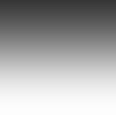  

## 完成Kulla Conty Approximation  

我们拿到已经预计算好的`E(μ)`和`E_avg`，现在就可以将新设计的`BRDF`积分值算出来了，代码实现如下：  
```cpp
//split sum
vec3 MultiScatterBRDF(float NdotL, float NdotV, vec3 F)
{
  vec3 albedo = pow(texture(uAlbedoMap, vTexCoords).rgb,vec3(2.2));

  // A split-sum result in which R-channel repesent F interger term
  vec3 E_o = texture(uKullaContyBrdflut, vec2(NdotL, uRoughness)).xyz;
  vec3 E_i = texture(uKullaContyBrdflut, vec2(NdotV, uRoughness)).xyz;
  // Split sum result add here.
  vec3 Emu_o = F * E_o.x + vec3(1.0) * E_o.y;
  vec3 Emu_i = F * E_i.x + vec3(1.0) * E_i.y;
  vec3 E_avg = texture(uKullaContyEavglut, vec2(0, uRoughness)).xyz;
  vec3 E_avgss = F * E_avg.x + vec3(1.0) * E_avg.y;
  ... 
  // TODO: To calculate fms and missing energy here
  vec3 F_ms = (1.0 - Emu_o) * (1.0 - Emu_i) / (PI * (1.0 - E_avgss));
  ...
  return F_ms;
}
```
目前来说，还只能补偿`albedo`为`1`情况下的能量。如果物体本身自带颜色，那还要考虑因为物体本身吸收能量而引起的能量损失。首先要定一个平均`Fresenl`项，来表示不同入射方向下打到微表面，平均被反射出去的能量占比多少。公式如下：  
$$
F_{avg}=\frac{\int_{0}^{1}F(\mu)\mu d\mu}{\int_{0}^{1}\mu d\mu} \\
=2\int_{0}^{1}F(\mu)\mu d\mu \tag{29}
$$
这篇[论文](https://blog.selfshadow.com/publications/s2017-shading-course/imageworks/s2017_pbs_imageworks_slides_v2.pdf)中，给出了该公式硬编码下的代码：  
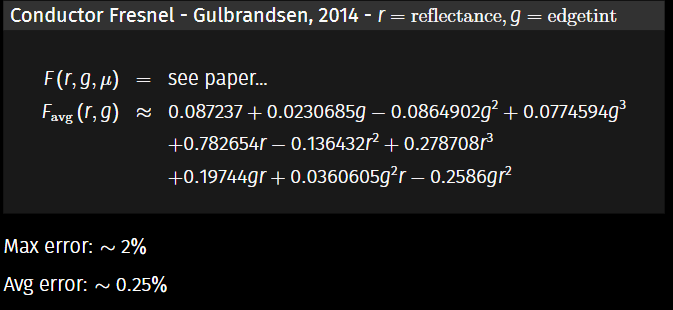   
其中`r`是`albedo`，入射角为0度时给的值。`g`是`EdgeTint`边缘色调，入射角为80度给的值。这篇[文章](https://groups.google.com/g/alshaders/c/IZTbaqJMQBo)教了我们怎么生成这两个值，我生成了金材质的`R`和`G`。`R(0.94423,0.77611,0.37217)`，`G(0.94806,0.86104,0.60760)`。  

有了`平均Fresenl`项，我们现在从新认识一下`E_avg`：含义为不考虑菲涅尔项时，不同入射角度打到微表面时，离开表面后平均能被你看到的能量。  

那考虑上物体本身会吸收的颜色，我们能看到一次反射后的平均能量为$F_{avg}E_{avg}$，则发生一次反射后没有出去的平均能量为$F_{avg}(1-E_{avg})$，然后这部分能量再次发生反射后我们能看到的平均能量为$F_{avg}(1-E_{avg})F_{avg}E_{avg}$，总结出`K`次反射后我们能看到的平均能量为$F_{avg}^{k}(1-E_{avg})^{k}F_{avg}E_{avg}$，最后将这部分能量全部加起来，就是一个级数，其数学公式为：  
$$
((F_{avg}(1-E_{avg}))^{0}+(F_{avg}^{}(1-E_{avg}))^{1}+(F_{avg}(1-E_{avg}))^{k})*F_{avg}E_{avg} \tag{30}
$$
前面部分是一个等比数列，由于`F_avg`和`1-E_avg`都是小于`1`的数，所以结果为：  
$$
=\frac{F_{avg}E_{avg}}{1-F_{avg}(1-E_{avg})} \tag{31}
$$
课堂上的讲解图片如下，需要注意的是这里的`one bounce`指的是两次反射：  
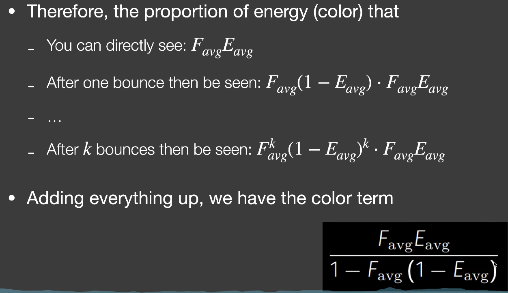  
这个公式就是颜色项，我们直接乘上之前没有考虑颜色时的能量补偿项，代码实现如下：  
```cpp
vec3 MultiScatterBRDF(float NdotL, float NdotV)
{
  vec3 albedo = pow(texture(uAlbedoMap, vTexCoords).rgb,vec3(2.2));
  vec3 E_o = texture(uKullaContyBrdflut, vec2(NdotL, uRoughness)).xyz;
  vec3 E_i = texture(uKullaContyBrdflut, vec2(NdotV, uRoughness)).xyz;
  vec3 E_avg = texture(uKullaContyEavglut, vec2(0, uRoughness)).xyz;
  //gold
  vec3 edgetint = vec3(0.94806,0.86104,0.60760);
  vec3 F_avg = AverageFresnel(albedo, edgetint);
  // TODO: To calculate fms and missing energy here
  vec3 F_ms = (1.0 - E_o) * (1.0 - E_i) / (PI * (1.0 - E_avg));
  vec3 F_add = F_avg * E_avg / (1.0 - F_avg * (1.0 - E_avg));
  return F_add * F_ms;
}
```
效果如下：  
