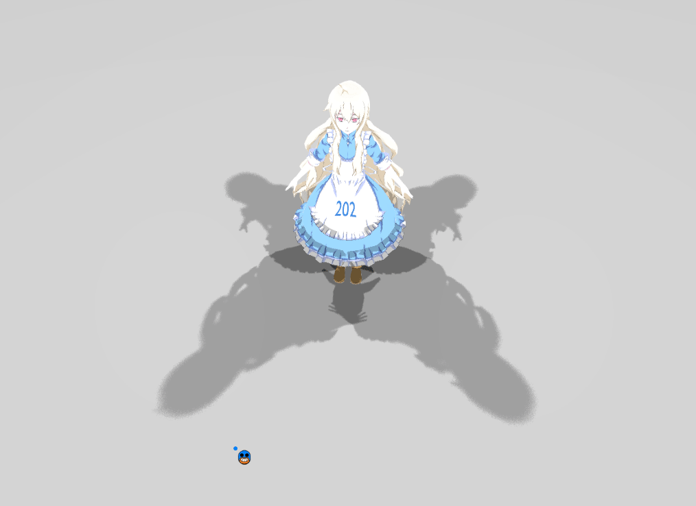
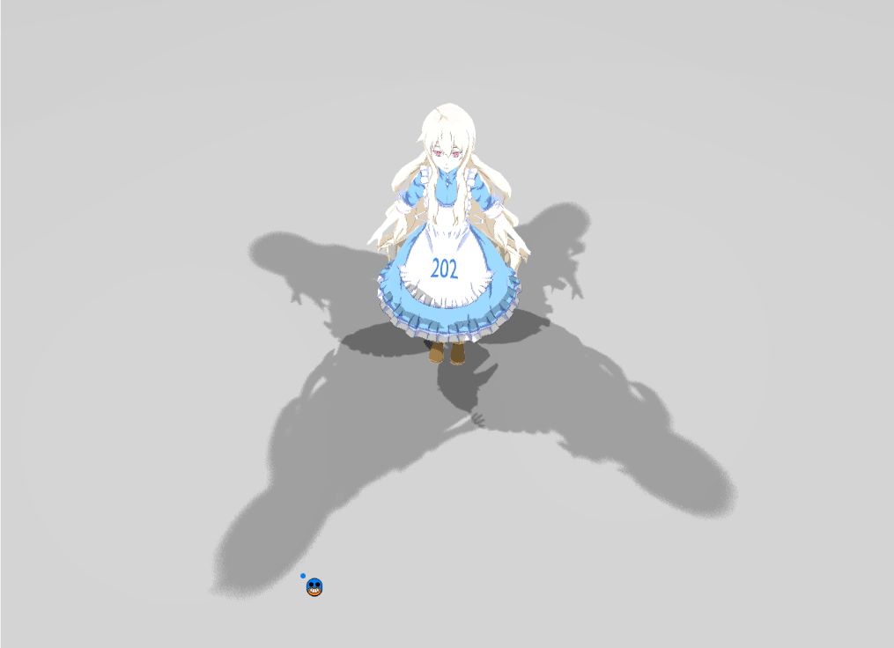
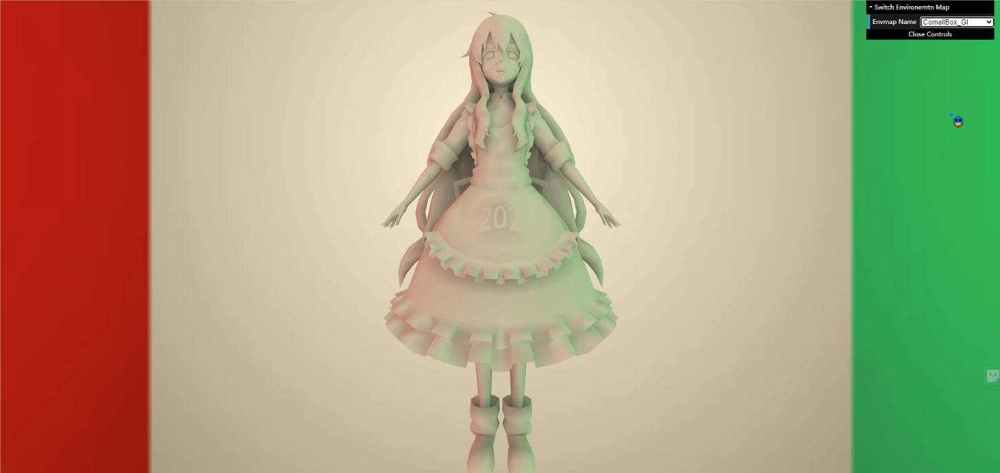
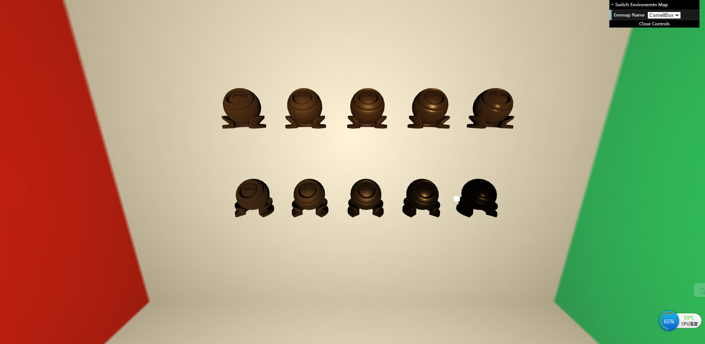

# games202

## 介绍
> 用``webgl``和``CPP``实现games202所提到的实时渲染的相关算法，避免``GIF``可能无法正常加载，此次文档使用``gIF``加``PNG``显示作品。  
> 电脑GPU（GPU AMD Radeon(TM) 530）很拉:expressionless:，部分结果无法更好展示，抱歉了。

## 1. Percentage Closer Soft Shadows
GIF  
##### PCSS

PNG

> ``PCSS``作业的基础要求，更多内容请参考[Assignment1\README](./Assignment1\README.md)。

## 2. Precomputed Radiance Transfer
GIF  
##### PRT

PNG

> ``PRT``作业的基础要求，更多内容请参考[Assignment2\README](./Assignment2\README.md)。

## 3. SSGI(Screen Space Global Illumination)
PNG  
##### Hierarchical-Z Texture Space Ray Marching Method

PNG  
##### Texture Space Ray Marching Method

PNG  
##### World Space Ray Marching Method

> ``Hi-z Method``帧率相比于``Texture Space Method``和``World Space Method``快了``5``倍左右:laughing:。 
>  
> ``Hi-z Texture Space Method``最初是由[GPU Pro 5](https://github.com/yyc-git/MyData/blob/master/3d/GPU%20Pro/GPU%20Pro%205.pdf)提出的，国外有[UP](https://sugulee.wordpress.com/2021/01/19/screen-space-reflections-implementation-and-optimization-part-2-hi-z-tracing-method/)对这一技术做了较好的解释,感兴趣的可以直接阅读原文，另外本次作业中我也对该方法的原理和代码做了详细说明，部分内容借鉴于该UP，更多内容在[Assignment3/README](./Assignment3\README.md)。  
> 
> ``Texture Space Method``是直接参考的一篇JCGT论文([Efficient GPU Screen-Space Ray Tracing](https://jcgt.org/published/0003/04/04/))，该论文的核心内容我也做了详细说明。按理来说``Texture Space Method``是要比``World Space Method``快才对，不过我电脑上测得帧率大致一样:sweat:。  
> 
> ``World Space Method``则是作业的基础要求。

## 4. Kulla-Conty-BRDF
PNG  
##### Split Sum Method

> ``Split Sum``作业的提高内容，更多内容请参考[Assignment4\README](./Assignment4\README.md)。

## 5. Real-Time Ray Tracing Denoisers
GIF  
##### Spatiotemporal Variance-Guided Filtering Method

PNG  

GIF  
##### Joint Bilateral Filter A-Trous Method

PNG  

> ``SVGF``是参考``文刀秋二``大佬发表的[论文](https://zhuanlan.zhihu.com/p/28288053),论文表示**filter**的对象是``像素Irradiance的灰度值``，而且是**直接光**和**间接光**分开处理，最后进行``Modulate``时将``Emission``和``Albedo``加回去，这样就可以保留图像的高频信息了。但是作业没有给每帧的``Albedo``，无法得到``像素的Irradiance``，而且**直接光**和**间接光**也是混合在一起进行**filter**的，所以右边那幅图像看起来会比较糊，更多内容请参考[Assignment5/README](./Assignment5\README.md)。  
> 
> ``JBF-atrous``则是作业的提高内容。