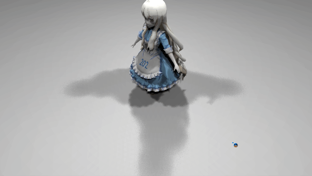
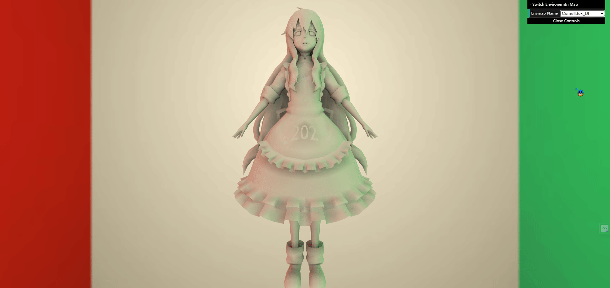
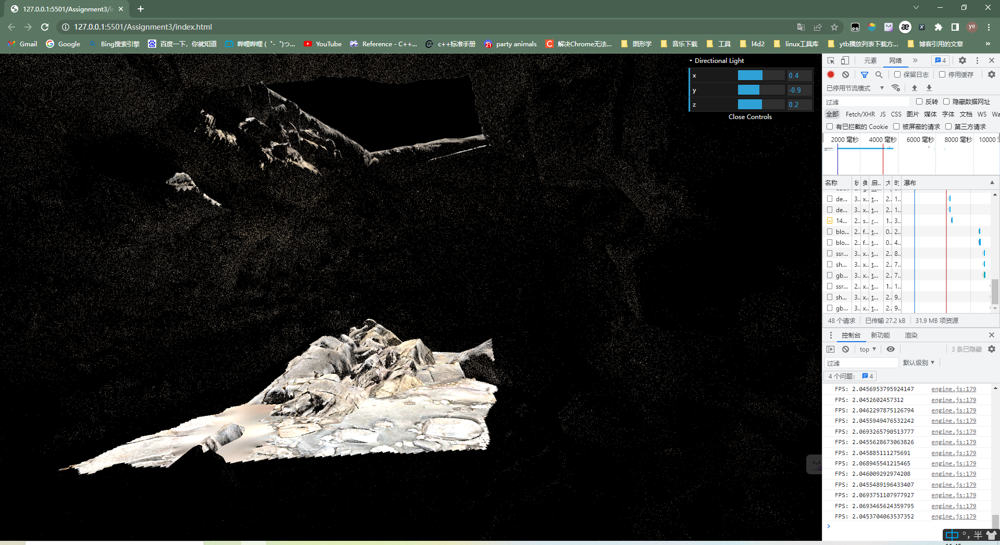
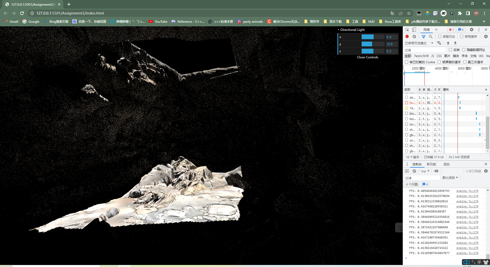
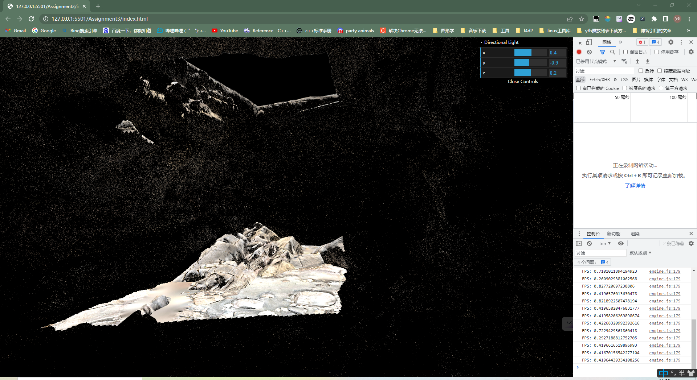
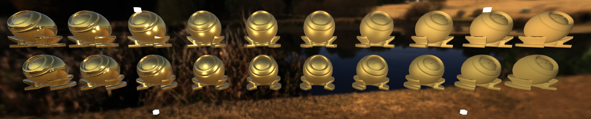
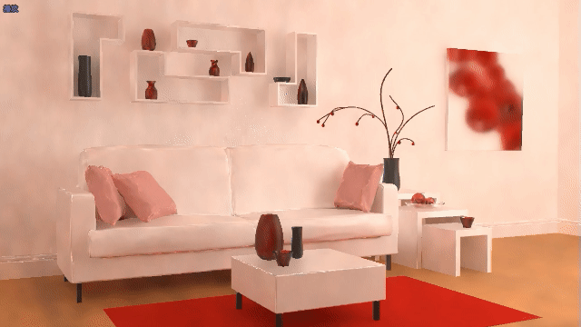
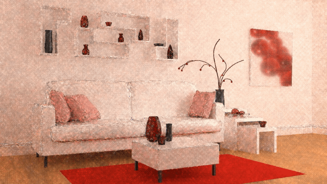

# games202  

## 介绍  

用`webgl`和`CPP`实现`games202`所提到的实时渲染的相关算法。为了节省存储空间，Github仓库未包含代码的原理解释等。  
电脑GPU`（GPU AMD Radeon(TM) 530）`很拉，部分结果无法更好展示，抱歉了😞。  
如果该项目对你有帮助，请给个星星吧😝~

## 1. Percentage Closer Soft Shadows   

##### PCSS  

   
`PCSS`作业的基础要求，更多内容请参考[我的博客-PCSS](https://howl144.github.io/2023/05/15/00015.%20Games202%20Hw1/)。  

## 2. Precomputed Radiance Transfer   

##### PRT  

   
`PRT`作业的基础要求，更多内容请参考[我的博客-PRT](https://howl144.github.io/2023/05/29/00016.%20Games202%20Hw2/)。  

## 3. Screen Space Reflection   

##### Hierarchical-Z SSR  

  

##### Efficient GPU SSR  

  

##### World Space Ray Marching SSR  

  
`Hi-z SSR`的帧率是`World Space SSR`的`4`倍左右😆。而`Efficient GPU SSR`的帧率是`World Space SSR`的`2`倍左右，可能是因为GPU太拉胯，这种复杂的场景导致它们显示的帧率几乎一致，我在作业三的`README`里面用简单的场景重新测试了一下，结果是`2`倍。  
`Hierarchical-Z SSR`最初是由[GPU Pro 5](https://github.com/yyc-git/MyData/blob/master/3d/GPU%20Pro/GPU%20Pro%205.pdf)提出的，国外有[UP](https://sugulee.wordpress.com/2021/01/19/screen-space-reflections-implementation-and-optimization-part-2-hi-z-tracing-method/)对这一技术做了较好的解释,感兴趣的可以直接阅读原文，另外本次作业中我也对该方法的原理和代码做了详细说明，部分内容借鉴于该`UP`。  

`Efficient GPU SSR`是直接参考的一篇JCGT论文([Efficient GPU Screen-Space Ray Tracing](https://jcgt.org/published/0003/04/04/))，该论文的核心内容我也做了详细说明。  

`World Space Ray Marching SSR`则是作业的基础要求。  

更多内容在[我的博客-SSR](https://howl144.github.io/2023/06/10/00017.%20Games202%20Hw3/)。  

## 4. Kulla-Conty BRDF  

##### IBL and Split Sum Kulla-Conty BRDF    

  
`Split Sum`为作业的提高内容，`IBL`为个人扩展内容，更多内容请参考[我的博客-KullaConty](https://howl144.github.io/2023/07/01/00018.%20Games202%20Hw4/)。  

## 5. Real-Time Ray Tracing Denoisers  

##### Spatiotemporal Variance-Guided Filtering Method  

  

##### Joint Bilateral Filter A-Trous Method  

  
`SVGF`是参考`文刀秋二`大佬发表的[论文](https://zhuanlan.zhihu.com/p/28288053),论文表示**filter**的对象是`像素Irradiance的灰度值`，而且是**直接光**和**间接光**分开处理，最后进行`Modulate`时将`Emission`和`Albedo`加回去，这样就可以保留图像的高频信息了。但是作业没有给每帧的`Albedo`，无法得到`像素的Irradiance`，而且**直接光**和**间接光**也是混合在一起进行**filter**的，所以右边那幅图像看起来会比较糊，更多内容请参考[我的博客-SVGF](https://howl144.github.io/2023/07/21/00019.%20Games202%20Hw5/)。  

`JBF-atrous`则是作业的提高内容。