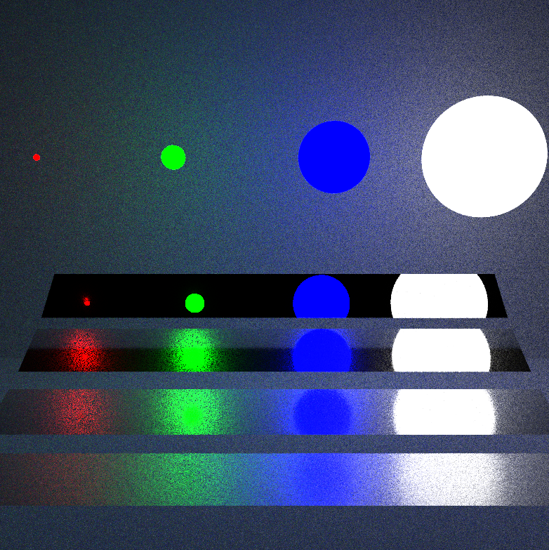
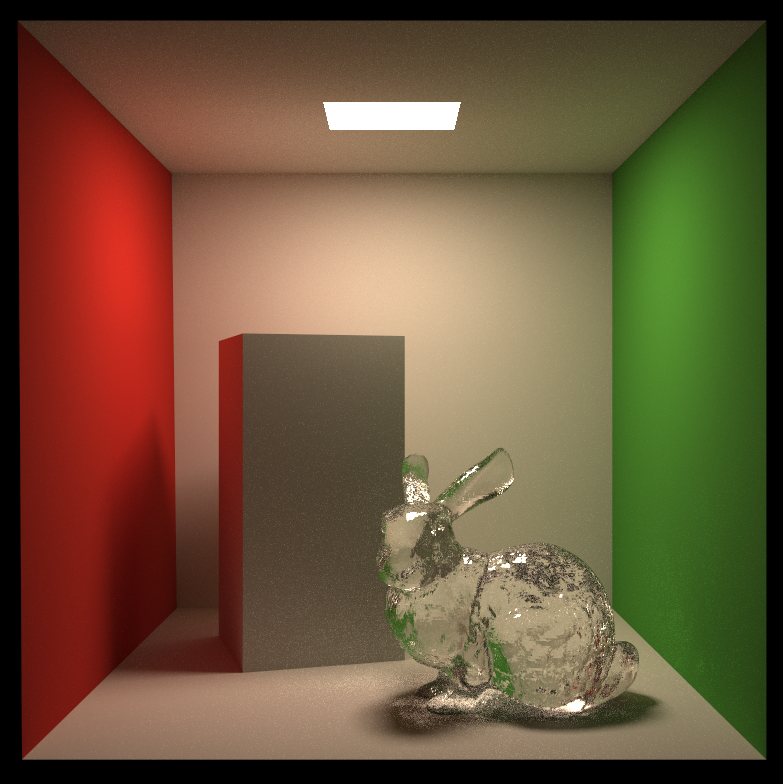

# GAMES101 Final Project 
Games101大作业，我选的是多重重要性采样，因为这个和Path Tracing关系很紧密，我觉得比较好实现，实验场景是自己搭建的，大家可以直接用，效果如下：  
`directLight Sampling`  
  
`brdf Sampling`  
  
`multiple importance sampling`
  
MIS是参考[pbrt](https://pbr-book.org/3ed-2018/Monte_Carlo_Integration/Importance_Sampling)实现的。  
此外还实现了`Roughness BSDF`，该内容参考的一篇[论文](https://www.cs.cornell.edu/~srm/publications/EGSR07-btdf.pdf)，效果如下：  
`1024spp`： `Specular` + `Glass`(0.08 roughness) + `Sliver`(0.4 roughness)  
  
`1024spp`： `Specular` + `Glass`(0.28 roughness)   
  
`1024spp`： `Diffuse` + `Glass`(0.08 roughness)  
  
更多内容请看我的[博客](https://howl144.github.io/2023/09/30/00014.%20Games101%20FinalProject/);  
其他的作业比较基础就不展开讨论了。  